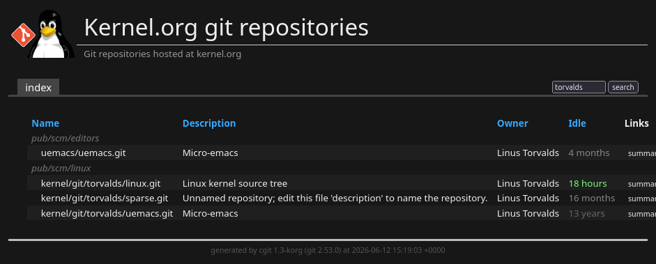
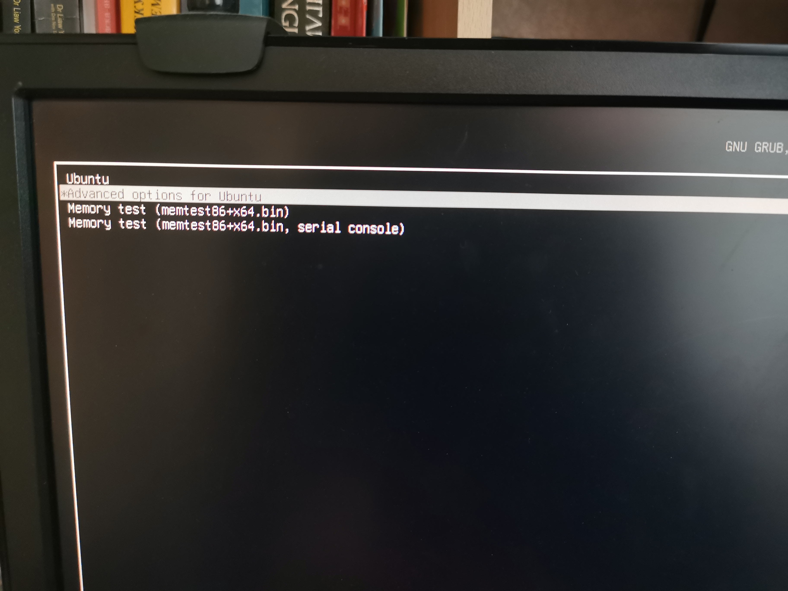
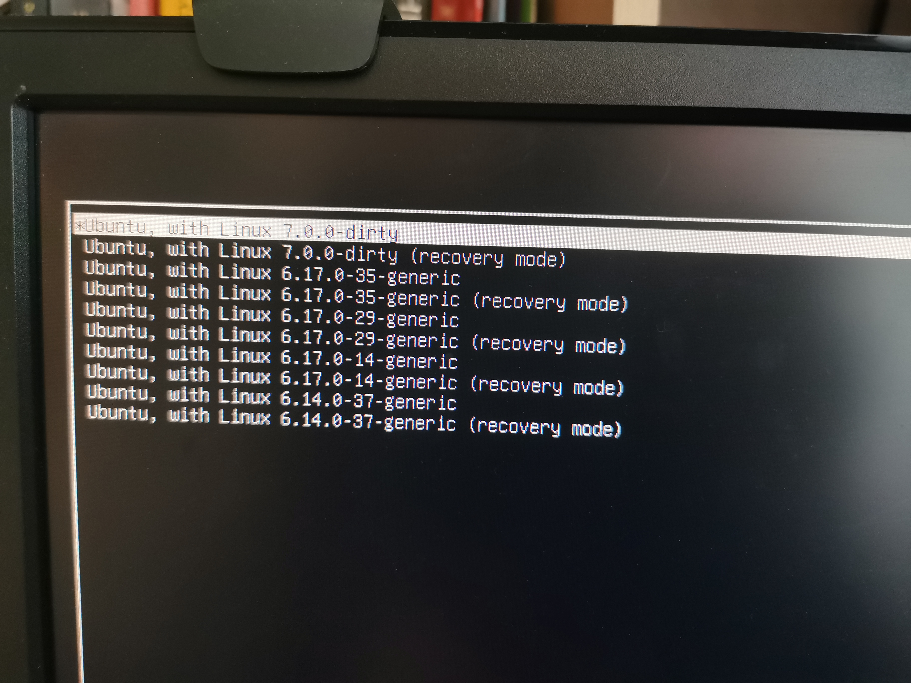

**Задание 17 - по ядру Linux**

## Часть первая: сборка ядра под x86\_64

### Скачиваем исходники

Поиском отфильтровал все репозитории Линуса

[https://git.kernel.org/?q=torvalds](https://git.kernel.org/?q=torvalds)



Открыл репозиторий **linux.git**. В самом низу страницы ссылки на клонирование. Склонировал репозиторий:
```
$ git clone --progress https://git.kernel.org/pub/scm/linux/kernel/git/torvalds/linux.git
Клонирование в «linux»...
remote: Enumerating objects: 11558624, done.
remote: Counting objects: 100% (718/718), done.
remote: Compressing objects: 100% (474/474), done.
remote: Total 11558624 (delta 394), reused 369 (delta 241), pack-reused 11557906 (from 1)
Получение объектов: 100% (11558624/11558624), 3.15 ГиБ | 10.97 МиБ/с, готово.
Определение изменений: 100% (9512569/9512569), готово.
Updating files: 100% (93709/93709), готово.
```

\*клонировал по HTTPS потому что через **git://** оно зависало после создания **.git** директории. Даже **iotop** пришлось поставить, чтобы убедиться, что никакой активности не происходит.

### Создаём конфигурацию

Попытался создать конфигурацию по умолчанию:
```
$ make defconfig
  HOSTCC  scripts/basic/fixdep
  HOSTCC  scripts/kconfig/conf.o
  HOSTCC  scripts/kconfig/confdata.o
  HOSTCC  scripts/kconfig/expr.o
  LEX     scripts/kconfig/lexer.lex.c
/bin/sh: 1: flex: not found
make[2]: *** [scripts/Makefile.host:9: scripts/kconfig/lexer.lex.c] Ошибка 127
make[1]: *** [/home/user/Documents/programming_practice/linux/Makefile:758: defconfig] Ошибка 2
make: *** [Makefile:248: __sub-make] Ошибка 2
```

Установил пакет **flex**:
```
$ sudo apt install flex
```
Вместе с ним также установились: **libfl-dev libfl2 m4**

Попробовал ещё раз:
```
$ make defconfig
  LEX     scripts/kconfig/lexer.lex.c
  YACC    scripts/kconfig/parser.tab.[ch]
/bin/sh: 1: bison: not found
make[2]: *** [scripts/Makefile.host:17: scripts/kconfig/parser.tab.h] Ошибка 127
make[1]: *** [/home/user/Documents/programming_practice/linux/Makefile:758: defconfig] Ошибка 2
make: *** [Makefile:248: __sub-make] Ошибка 2
```

Установил пакет **bison**:
```
$ sudo apt install bison
```

И ещё раз:
```
$ make defconfig
  YACC    scripts/kconfig/parser.tab.[ch]
  HOSTCC  scripts/kconfig/lexer.lex.o
  HOSTCC  scripts/kconfig/menu.o
  HOSTCC  scripts/kconfig/parser.tab.o
  HOSTCC  scripts/kconfig/preprocess.o
  HOSTCC  scripts/kconfig/symbol.o
  HOSTCC  scripts/kconfig/util.o
  HOSTLD  scripts/kconfig/conf
*** Default configuration is based on 'x86_64_defconfig'
#
# configuration written to .config
#
```

В этот раз успешно.

Далее попробовал обработать конфиг с учётом локальной конфигурации. Выдало много предупреждений:
```
$ make localmodconfig
using config: '.config'
polyval_clmulni config not found!
ghash_clmulni_intel config not found!
WARNING: SND_UMP is required, but nothing in the
  current config selects it.
WARNING: VIDEOBUF2_CORE is required, but nothing in the
  current config selects it.
WARNING: VIDEOBUF2_V4L2 is required, but nothing in the
  current config selects it.
WARNING: SND_SEQ_MIDI_EVENT is required, but nothing in the
  current config selects it.
WARNING: VIDEOBUF2_VMALLOC is required, but nothing in the
  current config selects it.
WARNING: INTEL_RAPL_CORE is required, but nothing in the
  current config selects it.
WARNING: IRQ_BYPASS_MANAGER is required, but nothing in the
  current config selects it.
WARNING: SND_HDA_CODEC_REALTEK_LIB is required, but nothing in the
  current config selects it.
WARNING: SND_RAWMIDI is required, but nothing in the
  current config selects it.
WARNING: VIDEOBUF2_MEMOPS is required, but nothing in the
  current config selects it.
WARNING: SPI_INTEL is required, but nothing in the
  current config selects it.
module parport_pc did not have configs CONFIG_PARPORT_PC
module qrtr did not have configs CONFIG_QRTR
module tpm_infineon did not have configs CONFIG_TCG_INFINEON
module snd_ump did not have configs CONFIG_SND_UMP
module hid_plantronics did not have configs CONFIG_HID_PLANTRONICS
module mei_hdcp did not have configs CONFIG_INTEL_MEI_HDCP
module rc_core did not have configs CONFIG_RC_CORE
module i2c_mux did not have configs CONFIG_I2C_MUX
module snd_hda_codec_generic did not have configs CONFIG_SND_HDA_GENERIC
module snd_rawmidi did not have configs CONFIG_SND_RAWMIDI
module snd_usbmidi_lib did not have configs CONFIG_SND_USB_AUDIO CONFIG_SND_USB_UA101 CONFIG_SND_USB_USX2Y CONFIG_SND_USB_US122L
module videobuf2_common did not have configs CONFIG_VIDEOBUF2_CORE
module snd_seq_midi_event did not have configs CONFIG_SND_SEQ_MIDI_EVENT
module coretemp did not have configs CONFIG_SENSORS_CORETEMP
module parport did not have configs CONFIG_PARPORT
module snd_hda_codec_alc882 did not have configs CONFIG_SND_HDA_CODEC_ALC882
module intel_rapl_common did not have configs CONFIG_INTEL_RAPL_CORE
module ip_tables did not have configs CONFIG_IP_NF_IPTABLES_LEGACY
module mei_pxp did not have configs CONFIG_INTEL_MEI_PXP
module serio_raw did not have configs CONFIG_SERIO_RAW
module lp did not have configs CONFIG_PRINTER
module videobuf2_v4l2 did not have configs CONFIG_VIDEOBUF2_V4L2
module snd_hda_codec_realtek_lib did not have configs CONFIG_SND_HDA_CODEC_REALTEK_LIB
module spi_intel did not have configs CONFIG_SPI_INTEL
module mtd did not have configs CONFIG_MTD
module at24 did not have configs CONFIG_EEPROM_AT24
module snd_hda_codec_intelhdmi did not have configs CONFIG_SND_HDA_CODEC_HDMI_INTEL
module videobuf2_memops did not have configs CONFIG_VIDEOBUF2_MEMOPS
module intel_powerclamp did not have configs CONFIG_INTEL_POWERCLAMP
module lpc_ich did not have configs CONFIG_LPC_ICH
module efi_pstore did not have configs CONFIG_EFI_VARS_PSTORE
module irqbypass did not have configs CONFIG_IRQ_BYPASS_MANAGER
module spi_intel_platform did not have configs CONFIG_SPI_INTEL_PLATFORM
module sch_fq_codel did not have configs CONFIG_NET_SCH_FQ_CODEL
module snd_hda_codec_hdmi did not have configs CONFIG_SND_HDA_CODEC_HDMI_GENERIC
module snd_seq_midi did not have configs CONFIG_SND_SEQ_MIDI
module videodev did not have configs CONFIG_VIDEO_DEV
module ppdev did not have configs CONFIG_PPDEV
module intel_rapl_msr did not have configs CONFIG_INTEL_RAPL
module cmdlinepart did not have configs CONFIG_MTD_CMDLINE_PARTS
module dmi_sysfs did not have configs CONFIG_DMI_SYSFS
module spi_nor did not have configs CONFIG_MTD_SPI_NOR
module videobuf2_vmalloc did not have configs CONFIG_VIDEOBUF2_VMALLOC
module gspca_main did not have configs CONFIG_USB_GSPCA
module kvm_intel did not have configs CONFIG_KVM_INTEL
module snd_usb_audio did not have configs CONFIG_SND_USB_AUDIO
module gspca_zc3xx did not have configs CONFIG_USB_GSPCA_ZC3XX
module mc did not have configs CONFIG_MEDIA_SUPPORT
module cec did not have configs CONFIG_CEC_CORE CONFIG_RAS_CEC
module aesni_intel did not have configs CONFIG_CRYPTO_AES_NI_INTEL
#
# configuration written to .config
#
```

Решил начать сначала:
```
$ make mrproper
CLEAN   scripts/basic
CLEAN   scripts/kconfig
CLEAN   include/config include/generated .config .config.old
```

Переключился на релиз **7.0**:
```
$ git switch --detach v7.0
Updating files: 100% (13501/13501), готово.
HEAD сейчас на 028ef9c96e96 Linux 7.0
```

Запустил генерацию конфига из локального:
```
$ make localmodconfig
  HOSTCC  scripts/basic/fixdep
  HOSTCC  scripts/kconfig/conf.o
  HOSTCC  scripts/kconfig/confdata.o
  HOSTCC  scripts/kconfig/expr.o
  LEX     scripts/kconfig/lexer.lex.c
  YACC    scripts/kconfig/parser.tab.[ch]
  HOSTCC  scripts/kconfig/lexer.lex.o
  HOSTCC  scripts/kconfig/menu.o
  HOSTCC  scripts/kconfig/parser.tab.o
  HOSTCC  scripts/kconfig/preprocess.o
  HOSTCC  scripts/kconfig/symbol.o
  HOSTCC  scripts/kconfig/util.o
  HOSTLD  scripts/kconfig/conf
using config: '/boot/config-6.17.0-35-generic'
polyval_clmulni config not found!
System keyring enabled but keys "debian/canonical-certs.pem" not found. Resetting keys to default value.
.config:12803:warning: symbol value 'n' invalid for BOOTPARAM_SOFTLOCKUP_PANIC
.config:12815:warning: symbol value 'n' invalid for BOOTPARAM_HUNG_TASK_PANIC
*
* Restart config...
*
*
* Scheduler features
*
Enable utilization clamping for RT/FAIR tasks (UCLAMP_TASK) [Y/n/?] y
  Number of supported utilization clamp buckets (UCLAMP_BUCKETS_COUNT) [5] 5
Proxy Execution (SCHED_PROXY_EXEC) [N/y/?] (NEW) 
...
...
...
  Test clocksource watchdog in kernel space (TEST_CLOCKSOURCE_WATCHDOG) [N/m/y/?] n
  Test module for correctness and stress of objpool (TEST_OBJPOOL) [N/m/?] n
  Test for Kexec HandOver (TEST_KEXEC_HANDOVER) [N/y/?] n
#
# configuration written to .config
#
```

На запросы принимал ответ по умолчанию.

Получил конфиги с разницей в 8559 строк:
```
$ diff -y --suppress-common-lines .config /boot/config-6.17.0-35-generic | wc -l
8559
```
Обратил внимание, что в текущем конфиге присутствуют модули для различных устройств и сенсоров из мира мобильных устройств, тогда как в сгенерированном конфиге большинство параметров не установлено (**is not set**):
```
# Linux/x86 7.0.0 Kernel Configuration                        | # Linux/x86 6.17.13 Kernel Configuration
CONFIG_CC_VERSION_TEXT="gcc (Ubuntu 13.3.0-6ubuntu2~24.04.1)  | CONFIG_CC_VERSION_TEXT="x86_64-linux-gnu-gcc-13 (Ubuntu 13.3.
CONFIG_RUSTC_VERSION=0                                        | CONFIG_RUSTC_VERSION=108200

...
...
...
                                                              > # Near Field Communication (NFC) devices
                                                              > #
                                                              > CONFIG_NFC_TRF7970A=m
                                                              > CONFIG_NFC_MEI_PHY=m
                                                              > CONFIG_NFC_SIM=m
                                                              > CONFIG_NFC_PORT100=m
                                                              > CONFIG_NFC_VIRTUAL_NCI=m
                                                              > CONFIG_NFC_FDP=m
                                                              > CONFIG_NFC_FDP_I2C=m

...
...
...
# CONFIG_TOUCHSCREEN_ADS7846 is not set                       | CONFIG_TOUCHSCREEN_ADS7846=m
# CONFIG_TOUCHSCREEN_AD7877 is not set                        | CONFIG_TOUCHSCREEN_AD7877=m
# CONFIG_TOUCHSCREEN_AD7879 is not set                        | CONFIG_TOUCHSCREEN_AD7879=m
...
...
...
                                                              > # Accelerometers
                                                              > #
                                                              > CONFIG_ADIS16201=m
                                                              > CONFIG_ADIS16209=m
                                                              > CONFIG_ADXL313=m
...
...
...
                                                              > # Chemical Sensors
                                                              > #
                                                              > CONFIG_AOSONG_AGS02MA=m
                                                              > CONFIG_ATLAS_PH_SENSOR=m
                                                              > CONFIG_ATLAS_EZO_SENSOR=m
                                                              > CONFIG_BME680=m
...
...
...
```

Видимо Ubuntu всё ещё планируют запускать на планшетах и смартфонах.

### Сборка ядра

Решил попробовать начать сборку со сгенерированным конфигом. И оно упало:
```
$ make -j$(nproc)
  SYSHDR  arch/x86/include/generated/uapi/asm/unistd_32.h
...
  DESCEND objtool
In file included from scripts/gendwarfksyms/gendwarfksyms.c:12:
scripts/gendwarfksyms/gendwarfksyms.h:6:10: fatal error: dwarf.h: Нет такого файла или каталога
    6 | #include <dwarf.h>
      |          ^~~~~~~~~
compilation terminated.
...
  CC      /home/user/Documents/programming_practice/linux/tools/objtool/arch/x86/special.o
In file included from /home/user/Documents/programming_practice/linux/tools/objtool/include/objtool/objtool.h:13,
                 from /home/user/Documents/programming_practice/linux/tools/objtool/include/objtool/arch.h:11,
                 from /home/user/Documents/programming_practice/linux/tools/objtool/include/objtool/check.h:11,
                 from /home/user/Documents/programming_practice/linux/tools/objtool/include/objtool/special.h:10,
                 from special.c:16:
/home/user/Documents/programming_practice/linux/tools/objtool/include/objtool/elf.h:10:10: fatal error: gelf.h: Нет такого файла или каталога
   10 | #include <gelf.h>
      |          ^~~~~~~~
In file included from /home/user/Documents/programming_practice/linux/tools/objtool/include/objtool/objtool.h:13,
                 from weak.c:10:
/home/user/Documents/programming_practice/linux/tools/objtool/include/objtool/elf.h:10:10: fatal error: gelf.h: Нет такого файла или каталога
   10 | #include <gelf.h>
      |          ^~~~~~~~
compilation terminated.
...
```

Нашёл в интернете, что надо доставить **dwarves, libdwarf-dev, libdw-dev и libelf-dev**.

Снова перезапустил **make** и снова упало на этот раз из-за **libssl**. Установил **libssl-dev**.

Дальше пошло, кулер в системнике загудел. Ушёл кушать.

Упало с ошибкой по поводу сертификатов Canonical — видимо часть конфигурации специфичной для Ubuntu:
```
make\[3\]: \*\*\* Нет правила для сборки цели «debian/canonical-revoked-certs.pem», требуемой для «certs/x509\_revocation\_list».  Останов.
make\[3\]: \*\*\* Ожидание завершения заданий...
GEN     certs/blacklist\_hash\_list
make\[2\]: \*\*\* \[scripts/Makefile.build:548: certs\] Ошибка 2
make\[2\]: \*\*\* Ожидание завершения заданий...
```

По поводу этой ошибки в интернете два варианта:

- отключить **Cryptographic API → Certificates for signature checking → Provide system-wide ring of revocation certificates**

- скопировать файл из **/usr/local/src/debian/** в директорию с исходниками ядра.

Иду вторым путём.

Директории **/usr/local/src/debian/** у меня нет:
```
$ ls -l /usr/local/src/debian/
ls: невозможно получить доступ к '/usr/local/src/debian/': Нет такого файла или каталога
```
Поиском по пакетам Ubuntu нашёл, что искомый файл содержится в пакете **linux-buildinfo**:

[https://packages.ubuntu.com/search?mode=exactfilename&suite=noble&section=all&arch=any&keywords=canonical-revoked-certs.pem&searchon=contents](https://packages.ubuntu.com/search?mode=exactfilename&suite=noble&section=all&arch=any&keywords=canonical-revoked-certs.pem&searchon=contents)

Находим в репозитории пакет нужной версии:
```
$ apt search linux-buildinfo
Сортировка... Готово
Полнотекстовый поиск... Готово
linux-buildinfo-6.11.0-1002-nvidia/noble-updates,noble-security 6.11.0-1002.2 amd64
  Linux kernel buildinfo for version 6.11.0 on 64 bit x86 SMP

linux-buildinfo-6.11.0-1003-nvidia/noble-updates,noble-security 6.11.0-1003.3 amd64
  Linux kernel buildinfo for version 6.11.0 on 64 bit x86 SMP

linux-buildinfo-6.11.0-1006-gcp/noble-updates,noble-security 6.11.0-1006.6~24.04.2 amd64
  Linux kernel buildinfo for version 6.11.0 on 64 bit x86 SMP

linux-buildinfo-6.11.0-1007-nvidia/noble-updates,noble-security 6.11.0-1007.7 amd64
  Linux kernel buildinfo for version 6.11.0 on 64 bit x86 SMP
...
...
...

$ apt search linux-buildinfo-7
Сортировка... Готово
Полнотекстовый поиск... Готово
linux-buildinfo-7.0.0-14-generic/noble-updates,noble-security 7.0.0-14.14~24.04.3 amd64
  Linux kernel buildinfo for version 7.0.0
```

Директория **/usr/local/src/debian/** так и не появилась. Смотрим куда распаковались файлы из установленного пакета:
```
$ dpkg -L linux-buildinfo-7.0.0-14-generic
/.
/usr
/usr/lib
/usr/lib/linux
/usr/lib/linux/7.0.0-14-generic
/usr/lib/linux/7.0.0-14-generic/abi
/usr/lib/linux/7.0.0-14-generic/canonical-certs.pem
/usr/lib/linux/7.0.0-14-generic/canonical-revoked-certs.pem
/usr/lib/linux/7.0.0-14-generic/compiler
/usr/lib/linux/7.0.0-14-generic/config
...
...
...
```

Копируем файл:
```
$ mkdir debian
$ cp -a /usr/lib/linux/7.0.0-14-generic/canonical-revoked-certs.pem ./debian/
```

Снова запускаем.

На моменте:
```
  CC [M]  drivers/gpu/drm/i915/i915_vgpu.o
  LD [M]  drivers/gpu/drm/i915/i915.o
  AR      drivers/gpu/built-in.a
  AR      drivers/built-in.a
  AR      built-in.a
  AR      vmlinux.a
  LD      vmlinux.o
```
кулер процессора притих.

Упало на том, что нет **gawk**:
```
/bin/sh: 1: gawk: not found
make[2]: *** [scripts/Makefile.vmlinux:153: modules.builtin.ranges] Ошибка 127
make[2]: *** Удаляется файл «modules.builtin.ranges»
make[2]: *** Ожидание завершения заданий...
make[1]: *** [/home/user/Documents/programming_practice/linux/Makefile:1299: vmlinux] Ошибка 2
make: *** [Makefile:248: __sub-make] Ошибка 2
Сб 13 июн 2026 17:25:37 +07
```

Заглянул в файл **Documentation/Changes** — там есть список необходимых утилит:
```
$ grep -A35 "Minimal version" Documentation/Changes 
        Program        Minimal version       Command to check the version
====================== ===============  ========================================
GNU C                  8.1              gcc --version
Clang/LLVM (optional)  15.0.0           clang --version
Rust (optional)        1.78.0           rustc --version
bindgen (optional)     0.65.1           bindgen --version
GNU make               4.0              make --version
bash                   4.2              bash --version
binutils               2.30             ld -v
flex                   2.5.35           flex --version
bison                  2.0              bison --version
pahole                 1.22             pahole --version
util-linux             2.10o            mount --version
kmod                   13               depmod -V
e2fsprogs              1.41.4           e2fsck -V
jfsutils               1.1.3            fsck.jfs -V
xfsprogs               2.6.0            xfs_db -V
squashfs-tools         4.0              mksquashfs -version
btrfs-progs            0.18             btrfs --version
pcmciautils            004              pccardctl -V
quota-tools            3.09             quota -V
PPP                    2.4.0            pppd --version
nfs-utils              1.0.5            showmount --version
procps                 3.2.0            ps --version
udev                   081              udevd --version
grub                   0.93             grub --version || grub-install --version
mcelog                 0.6              mcelog --version
iptables               1.4.2            iptables -V
openssl & libcrypto    1.0.0            openssl version
bc                     1.06.95          bc --version
Sphinx\ [#f1]_         3.4.3            sphinx-build --version
GNU tar                1.28             tar --version
gtags (optional)       6.6.5            gtags --version
mkimage (optional)     2017.01          mkimage --version
Python                 3.9.x            python3 --version
GNU AWK (optional)     5.1.0            gawk --version
```

Проверил неизвестные мне на наличие.

У меня не установлен **udev** и в репозитории тоже не нашлось. Надеюсь, что это **systemd-udevd.service**:
```
$ systemctl list-units | grep udev
  systemd-udev-trigger.service         loaded active exited    Coldplug All udev Devices
  systemd-udevd.service                loaded active running   Rule-based Manager for Device Events and Files
  systemd-udevd-control.socket         loaded active running   udev Control Socket
  systemd-udevd-kernel.socket          loaded active running   udev Kernel Socket
```

Кроме того, установил **jfsutils, xfsprogs, btrfs-progs, quota, nfs-common, global**. Не удалось установить **mcelog**. В интернете пишут, что оно было заменено на **rasdaemon** — его и установил. С другой стороны, в **Documentation/Changes** ниже есть описание, в каких ситуациях какие утилиты используются. По-хорошему, надо было проверить, включены ли у меня параметры, где эти утилиты нужны или нет.

Пробую запустить компиляцию ядра опять.

Успешно заканчивается в этот раз.
```
...
...
...
  BTF [M] net/netfilter/nf_tables.ko
  MKPIGGY arch/x86/boot/compressed/piggy.S
  AS      arch/x86/boot/compressed/piggy.o
  LD      arch/x86/boot/compressed/vmlinux
  ZOFFSET arch/x86/boot/zoffset.h
  OBJCOPY arch/x86/boot/vmlinux.bin
  AS      arch/x86/boot/header.o
  LD      arch/x86/boot/setup.elf
  OBJCOPY arch/x86/boot/setup.bin
  BUILD   arch/x86/boot/bzImage
Kernel: arch/x86/boot/bzImage is ready  (#2)
```

### Сборка DEB пакета

Пытаюсь собрать пакет, который можно будет установить в систему:
```
$ make deb-pkg
  GEN     debian
  UPD     .tmp_HEAD
  ARCHIVE linux.tar.gz
dpkg-buildpackage --build=source,binary --no-pre-clean --unsigned-changes --unsigned-source --compression=gzip -R'make -f debian/rules' -j1 -a$(cat debian/arch)
dpkg-buildpackage: инфо: пакет исходного кода linux-upstream
dpkg-buildpackage: инфо: версия исходного кода 7.0.0-3
dpkg-buildpackage: инфо: дистрибутив исходного кода noble
dpkg-buildpackage: инфо: исходный код изменён user <user@oboltus-depo>
dpkg-buildpackage: инфо: архитектура узла amd64
 dpkg-source --compression=gzip --before-build .
dpkg-source: инфо: используются параметры из linux/debian/source/local-options: --diff-ignore --extend-diff-ignore=.*
dpkg-checkbuilddeps: ошибка: Unmet build dependencies: debhelper-compat (= 12)
dpkg-buildpackage: предупреждение: неудовлетворительные зависимости/конфликты при сборке; прерываемся
dpkg-buildpackage: предупреждение: (Используйте параметр -d, чтобы продолжить сборку.)
make[2]: *** [scripts/Makefile.package:126: deb-pkg] Ошибка 3
make[1]: *** [/home/user/Documents/programming_practice/linux/Makefile:1720: deb-pkg] Ошибка 2
make: *** [Makefile:248: __sub-make] Ошибка 2
```

Устанавливаю **debhelper**. Вместе с ним ставятся следующие пакеты: **autoconf automake autopoint autotools-dev debhelper debugedit dh-autoreconf dh-strip-nondeterminism dwz gettext intltool-debian libarchive-cpio-perl libarchive-zip-perl libdebhelper-perl libfile-stripnondeterminism-perl libltdl-dev libsub-override-perl libtool po-debconf**

Снова запускаю сборку пакета:
```
$ make deb-pkg
```

Падает с
```
make\[6\]: \*\*\* Нет правила для сборки цели «debian/canonical-revoked-certs.pem», требуемой для «certs/x509\_revocation\_list».  Останов.
```

Файла снова нет в директории **./debian**. Копируем по старинке.
```
cp -a /usr/lib/linux/7.0.0-14-generic/canonical-revoked-certs.pem ./debian/
```

И запускаем сборку DEB пакета ещё раз.

И снова падает с той же ошибкой и файл опять пропадает. Судя по всему оно его удаляет в процессе.

В конец **./certs/Makefile** добавил «правило» для сборки:
```
debian/canonical-revoked-certs.pem:
    @mkdir -p debian && cp -a /usr/lib/linux/7.0.0-14-generic/canonical-revoked-certs.pem $@
```

И запускаем сборку DEB пакета ещё раз.

### Установка DEB пакета в систему

Появляются установочные файлы на уровень выше:
```
$ ls ..
C_basics
DSA_practice
eltex-ibelash-homework
experiments_eltex
linux
linux-headers-7.0.0-dirty_7.0.0-12_amd64.deb
linux-image-7.0.0-dirty_7.0.0-12_amd64.deb
linux-image-7.0.0-dirty-dbg_7.0.0-12_amd64.deb
linux-libc-dev_7.0.0-12_amd64.deb
linux-upstream_7.0.0-12_amd64.buildinfo
linux-upstream_7.0.0-12_amd64.changes
linux-upstream_7.0.0-4.debian.tar.gz
linux-upstream_7.0.0-4.dsc
linux-upstream_7.0.0-5.debian.tar.gz
linux-upstream_7.0.0-5.dsc
linux-upstream_7.0.0.orig.tar.gz
```

Пробую установить:
```
$ cd ..
$ sudo dpkg -i *.deb
[sudo] пароль для user: 
Выбор ранее не выбранного пакета linux-headers-7.0.0-dirty.
(Чтение базы данных ... на данный момент установлено 338273 файла и каталога.)
Подготовка к распаковке linux-headers-7.0.0-dirty_7.0.0-12_amd64.deb ...
Распаковывается linux-headers-7.0.0-dirty (7.0.0-12) ...
Выбор ранее не выбранного пакета linux-image-7.0.0-dirty.
Подготовка к распаковке linux-image-7.0.0-dirty_7.0.0-12_amd64.deb ...
Распаковывается linux-image-7.0.0-dirty (7.0.0-12) ...
Выбор ранее не выбранного пакета linux-image-7.0.0-dirty-dbg.
Подготовка к распаковке linux-image-7.0.0-dirty-dbg_7.0.0-12_amd64.deb ...
Распаковывается linux-image-7.0.0-dirty-dbg (7.0.0-12) ...
Подготовка к распаковке linux-libc-dev_7.0.0-12_amd64.deb ...
Распаковывается linux-libc-dev:amd64 (7.0.0-12) на замену (6.8.0-124.124) ...
Настраивается пакет linux-headers-7.0.0-dirty (7.0.0-12) ...
Настраивается пакет linux-image-7.0.0-dirty (7.0.0-12) ...
update-initramfs: Generating /boot/initrd.img-7.0.0-dirty
I: The initramfs will attempt to resume from /dev/sda2
I: (UUID=0d559039-df41-4ded-aea1-b138e6cae3b8)
I: Set the RESUME variable to override this.
Sourcing file `/etc/default/grub'
Generating grub configuration file ...
Found linux image: /boot/vmlinuz-7.0.0-dirty
Found initrd image: /boot/initrd.img-7.0.0-dirty
Found linux image: /boot/vmlinuz-6.17.0-35-generic
Found initrd image: /boot/initrd.img-6.17.0-35-generic
Found linux image: /boot/vmlinuz-6.17.0-29-generic
Found initrd image: /boot/initrd.img-6.17.0-29-generic
Found linux image: /boot/vmlinuz-6.17.0-14-generic
Found initrd image: /boot/initrd.img-6.17.0-14-generic
Found linux image: /boot/vmlinuz-6.14.0-37-generic
Found initrd image: /boot/initrd.img-6.14.0-37-generic
Found memtest86+x64 image: /boot/memtest86+x64.bin
Warning: os-prober will not be executed to detect other bootable partitions.
Systems on them will not be added to the GRUB boot configuration.
Check GRUB_DISABLE_OS_PROBER documentation entry.
Adding boot menu entry for UEFI Firmware Settings ...
done
Настраивается пакет linux-image-7.0.0-dirty-dbg (7.0.0-12) ...
Настраивается пакет linux-libc-dev:amd64 (7.0.0-12) ...
```

Перезагружаюсь.

### Загрузка с новым ядром

Дописываю отчёт загрузившись с новым ядром:
```
$ uname -a
Linux oboltus-depo 7.0.0-dirty #12 SMP PREEMPT_DYNAMIC Sat Jun 13 20:44:26 +07 2026 x86_64 x86_64 x86_64 GNU/Linux
```

При загрузке в меню GRUB выбрал **Advanced options for Ubuntu → Ubuntu, with Linux 7.0.0-dirty**.

Ну и так как это реальная железо, а не виртуалка, то прикладываю фото вместо скриншотов:





