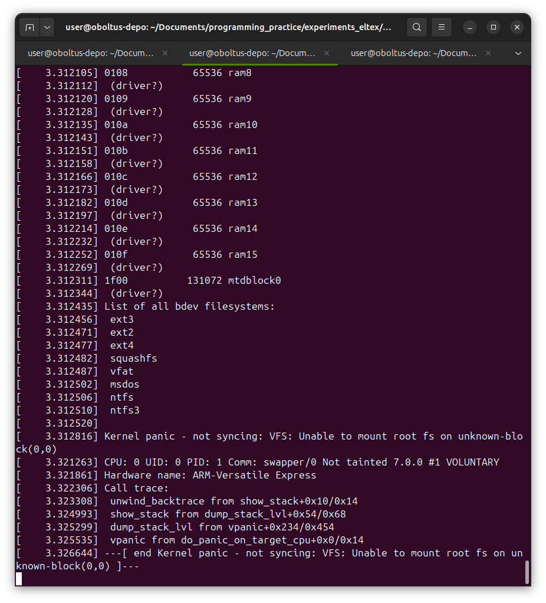

**Задание 17 - по ядру Linux**

## Часть вторая: сборка кросс-компилятором ядра под arm

### Восстанавливаем исходное состояние исходного кода

Зачистил предыдущую сборку с x86\_64

```
$ make mrproper
  CLEAN   arch/x86/boot/compressed
  CLEAN   arch/x86/boot
  CLEAN   arch/x86/entry/vdso/vdso32
  CLEAN   arch/x86/entry/vdso/vdso64
  CLEAN   arch/x86/kernel/cpu
  CLEAN   arch/x86/kernel
  CLEAN   arch/x86/kvm
  CLEAN   arch/x86/purgatory
  CLEAN   arch/x86/realmode/rm
  CLEAN   arch/x86/tools
  CLEAN   arch/x86/lib
  CLEAN   certs
  CLEAN   drivers/firmware/efi/libstub
  CLEAN   drivers/gpu/drm/xe
  CLEAN   drivers/scsi
  CLEAN   drivers/tty/vt
  CLEAN   fs/unicode
  CLEAN   init
  CLEAN   kernel/debug/kdb
  CLEAN   kernel
  CLEAN   lib/crc
  CLEAN   lib/crypto
  CLEAN   lib/test_fortify
  CLEAN   lib
  CLEAN   security/apparmor
  CLEAN   security/ipe
  CLEAN   security/selinux
  CLEAN   security/tomoyo
  CLEAN   usr/include
  CLEAN   usr
  CLEAN   .
  CLEAN   modules.builtin modules.builtin.modinfo modules.builtin.ranges vmlinux.o.map vmlinux.unstripped .vmlinux.objs .vmlinux.export.c
  CLEAN   scripts/basic
  CLEAN   scripts/gdb/linux
  CLEAN   scripts/gendwarfksyms
  CLEAN   scripts/ipe/polgen
  CLEAN   scripts/kconfig
  CLEAN   scripts/mod
  CLEAN   scripts/selinux/mdp
  CLEAN   scripts
  CLEAN   include/config include/generated arch/x86/include/generated debian .config .config.old .version Module.symvers certs/signing_key.pem certs/x509.genkey vmlinux-gdb.py 
```

С помощью git diff и git status нашёл другие файлы, состояние которых необходимо восстановить. Такой файл только один - certs/Makefile:
```
$ git diff
diff --git a/certs/Makefile b/certs/Makefile
index 3ee1960f9f4a..c9a3f38dc62c 100644
--- a/certs/Makefile
+++ b/certs/Makefile
@@ -89,3 +89,6 @@ hostprogs := extract-cert
 
 HOSTCFLAGS_extract-cert.o = $(shell $(HOSTPKG_CONFIG) --cflags libcrypto 2> /dev/null) -I$(srctree)/scripts
 HOSTLDLIBS_extract-cert = $(shell $(HOSTPKG_CONFIG) --libs libcrypto 2> /dev/null || echo -lcrypto)
+
+debian/canonical-revoked-certs.pem:
+       mkdir -p debian && cp -va /usr/lib/linux/7.0.0-14-generic/canonical-revoked-certs.pem $@

$ git restore certs/Makefile

$ git status
Отсоединённый указатель HEAD указывает на v7.0
нечего коммитить, нет изменений в рабочем каталоге
```

### Создаём конфигурацию

Создаём конфигурацию по умолчанию. Обязательно предваряем команду make переменной ARCH со значением `arm`.
```
$ ARCH=arm make defconfig
  HOSTCC  scripts/basic/fixdep
  HOSTCC  scripts/kconfig/conf.o
  HOSTCC  scripts/kconfig/confdata.o
  HOSTCC  scripts/kconfig/expr.o
  LEX     scripts/kconfig/lexer.lex.c
  YACC    scripts/kconfig/parser.tab.[ch]
  HOSTCC  scripts/kconfig/lexer.lex.o
  HOSTCC  scripts/kconfig/menu.o
  HOSTCC  scripts/kconfig/parser.tab.o
  HOSTCC  scripts/kconfig/preprocess.o
  HOSTCC  scripts/kconfig/symbol.o
  HOSTCC  scripts/kconfig/util.o
  HOSTLD  scripts/kconfig/conf
*** Default configuration is based on 'multi_v7_defconfig'
#
# configuration written to .config
#
```

### Запускаем компиляцию

Устанавливаем компилятор gcc gnueabihf для arm:
```
$ apt search gcc gnueabi arm
Сортировка… Готово
Полнотекстовый поиск… Готово
cpp-10-arm-linux-gnueabi/noble-updates,noble-security 10.5.0-4ubuntu2.1cross1 amd64
  препроцессор GNU C

cpp-10-arm-linux-gnueabihf/noble-updates,noble-security 10.5.0-4ubuntu2.1cross1 amd64
  препроцессор GNU C
...
...
...
gcc-14-plugin-dev-arm-linux-gnueabihf/noble-updates,noble-security 14.2.0-4ubuntu2~24.04.1cross1 amd64
  Files for GNU GCC plugin development.
...
...
...
$ sudo apt install gcc-14-plugin-dev-arm-linux-gnueabihf
...
...
...
```

Вместе с компилятором установились следующие пакеты: 
  binutils-arm-linux-gnueabihf cpp-14-arm-linux-gnueabihf
  gcc-14-arm-linux-gnueabihf gcc-14-arm-linux-gnueabihf-base gcc-14-cross-base
  gcc-14-plugin-dev-arm-linux-gnueabihf libasan8-armhf-cross libatomic1-armhf-cross
  libc6-armhf-cross libc6-dev-armhf-cross libgcc-14-dev-armhf-cross
  libgcc-s1-armhf-cross libgmp-dev libgmpxx4ldbl libgomp1-armhf-cross libmpc-dev
  libmpfr-dev libstdc++6-armhf-cross libubsan1-armhf-cross
  linux-libc-dev-armhf-cross


Перед запуском компиляции посмотрел как используются переменные в Makefile:
```
$ grep -n CROSS ./Makefile 
396:# CROSS_COMPILE specify the prefix used for all executables used
398:# are prefixed with $(CROSS_COMPILE).
399:# CROSS_COMPILE can be set on the command line
400:# make CROSS_COMPILE=aarch64-linux-gnu-
401:# Alternatively CROSS_COMPILE can be set in the environment.
402:# Default value for CROSS_COMPILE is not to prefix executables
403:# Note: Some architectures assign CROSS_COMPILE in their arch/*/Makefile
525:CC		= $(CROSS_COMPILE)gcc
526:LD		= $(CROSS_COMPILE)ld
527:AR		= $(CROSS_COMPILE)ar
528:NM		= $(CROSS_COMPILE)nm
529:OBJCOPY		= $(CROSS_COMPILE)objcopy
530:OBJDUMP		= $(CROSS_COMPILE)objdump
531:READELF		= $(CROSS_COMPILE)readelf
532:STRIP		= $(CROSS_COMPILE)strip
631:export ARCH SRCARCH CONFIG_SHELL BASH HOSTCC KBUILD_HOSTCFLAGS CROSS_COMPILE LD CC HOSTPKG_CONFIG
714:# Some architectures define CROSS_COMPILE in arch/$(SRCARCH)/Makefile.
```

Обратил внимание, что на 400й строке показано как правильно задавать префикс утилит. 
А на 714й ещё более интересная заметка... но, к сожалению, arm не задаёт CROSS\_COMPILE в своём Makefile.

Проверил, что утилиты перечисленные в Makefile на строках 525 - 532 присутствуют в моей системе (набрал arm и нажал Tab два раза).

Запускаем компиляцию
И она падает:
```
$ ARCH=arm CROSS_COMPILE=arm-linux-gnueabihf- make -j$(nproc) zImage
make[1]: arm-linux-gnueabihf-gcc: Нет такого файла или каталога
  SYNC    include/config/auto.conf.cmd
make[2]: arm-linux-gnueabihf-gcc: Нет такого файла или каталога
scripts/Kconfig.include:40: C compiler 'arm-linux-gnueabihf-gcc' not found
make[3]: *** [scripts/kconfig/Makefile:85: syncconfig] Ошибка 1
make[2]: *** [Makefile:747: syncconfig] Ошибка 2
make[1]: *** [/home/user/Documents/programming_practice/linux/Makefile:867: include/config/auto.conf.cmd] Ошибка 2
make[1]: *** [include/config/auto.conf.cmd] Удаляется файл «include/generated/rustc_cfg»
make[1]: *** [include/config/auto.conf.cmd] Удаляется файл «include/generated/autoconf.h»
make: *** [Makefile:248: __sub-make] Ошибка 2
```

Видимо я не тот пакет поставил. Нашёл в пакетах пакет с нужным компилятором и установил его:
```
$ sudo apt install gcc-arm-linux-gnueabihf
```

Также установились следующие пакеты:
  cpp-13-arm-linux-gnueabihf cpp-arm-linux-gnueabihf gcc-13-arm-linux-gnueabihf
  gcc-13-arm-linux-gnueabihf-base gcc-13-cross-base gcc-arm-linux-gnueabihf
  libgcc-13-dev-armhf-cross


Снова запускаю компиляцию, в этот раз успешно. 
При этом в начале пришлось ответить на пару вопросов (отвечал по умолчанию):
```
$ ARCH=arm CROSS_COMPILE=arm-linux-gnueabihf- make -j$(nproc) zImage
  SYNC    include/config/auto.conf.cmd
*
* Restart config...
*
*
* Kernel Features
*
Symmetric Multi-Processing (SMP) [Y/n/?] y
  Allow booting SMP kernel on uniprocessor systems (SMP_ON_UP) [Y/n/?] y
Support cpu topology definition (ARM_CPU_TOPOLOGY) [Y/n/?] y
Architected timer support (HAVE_ARM_ARCH_TIMER) [Y/?] y
Multi-Cluster Power Management (MCPM) [Y/?] y
big.LITTLE support (Experimental) (BIG_LITTLE) [N/y/?] n
Memory split
> 1. 3G/1G user/kernel split (VMSPLIT_3G)
  2. 3G/1G user/kernel split (for full 1G low memory) (VMSPLIT_3G_OPT)
  3. 2G/2G user/kernel split (VMSPLIT_2G)
  4. 1G/3G user/kernel split (VMSPLIT_1G)
choice[1-4?]: 1
Maximum number of CPUs (2-32) (NR_CPUS) [16] 16
Support for hot-pluggable CPUs (HOTPLUG_CPU) [Y/?] y
Support for the ARM Power State Coordination Interface (PSCI) (ARM_PSCI) [Y/?] y
Timer frequency
> 1. 100 Hz (HZ_100)
  2. 200 Hz (HZ_200)
  3. 250 Hz (HZ_250)
  4. 300 Hz (HZ_300)
  5. 500 Hz (HZ_500)
  6. 1000 Hz (HZ_1000)
choice[1-6?]: 1
Compile the kernel in Thumb-2 mode (THUMB2_KERNEL) [N/y/?] n
Runtime patch udiv/sdiv instructions into __aeabi_{u}idiv() (ARM_PATCH_IDIV) [Y/n/?] y
Use the ARM EABI to compile the kernel (AEABI) [Y/?] y
  Allow old ABI binaries to run with this kernel (EXPERIMENTAL) (OABI_COMPAT) [N/y/?] n
High Memory Support (HIGHMEM) [Y/?] y
Enable privileged no-access (ARM_PAN) [Y/n/?] y
Use PLTs to allow module memory to spill over into vmalloc area (ARM_MODULE_PLTS) [Y/n/?] y
Order of maximal physically contiguous allocations (ARCH_FORCE_MAX_ORDER) [11] 11
Use kernel mem{cpy,set}() for {copy_to,clear}_user() (UACCESS_WITH_MEMCPY) [N/y/?] n
Enable paravirtualization code (PARAVIRT) [N/y/?] n
Paravirtual steal time accounting (PARAVIRT_TIME_ACCOUNTING) [N/y/?] n
Xen guest support on ARM (XEN) [N/y/?] n
Use a unique stack canary value for each task (STACKPROTECTOR_PER_TASK) [Y/n/?] (NEW) 
  UPD     include/generated/uapi/linux/version.h
  SYSHDR  arch/arm/include/generated/uapi/asm/unistd-oabi.h
  SYSHDR  arch/arm/include/generated/uapi/asm/unistd-eabi.h
  HOSTCC  scripts/dtc/dtc.o
  HOSTCC  scripts/dtc/flattree.o
  HOSTCC  scripts/dtc/fstree.o
  WRAP    arch/arm/include/generated/uapi/asm/kvm_para.h
...
...
...
```
По традиции кулер зашумел на полную. 
_Надо компилировать ядра зимой, когда дома прохладно, а не летом, когда итак уже жарко._


Примерно через 10 минут сборка была закончена.
Скопировал ядро в отдельную директорию:
```
$ mkdir ../experiments_eltex/arm_kernel
$ cp -a ./arch/arm/boot/zImage ../experiments_eltex/arm_kernel/
```

### Сборка Device tree

Зашёл в ./arch/arm/boot/dts/ как показывали на лекции, но там никаких vexpress не оказалось. 
Рекурсивным grep обнаружил их в поддиректории arm:
```
$ grep -R vexpress ./arch/arm/boot/dts/
./arch/arm/boot/dts/arm/vexpress-v2p-ca9.dts:#include "vexpress-v2m.dtsi"
./arch/arm/boot/dts/arm/vexpress-v2p-ca9.dts:	arm,vexpress,site = <0xf>;
./arch/arm/boot/dts/arm/vexpress-v2p-ca9.dts:	compatible = "arm,vexpress,v2p-ca9", "arm,vexpress";
./arch/arm/boot/dts/arm/vexpress-v2p-ca9.dts:		compatible = "arm,vexpress,config-bus";
...
...
...
./arch/arm/boot/dts/arm/vexpress-v2m.dtsi:					arm,vexpress-sysreg,func = <9 0>;
./arch/arm/boot/dts/arm/vexpress-v2m.dtsi:					compatible = "arm,vexpress-dvimode";
./arch/arm/boot/dts/arm/vexpress-v2m.dtsi:					arm,vexpress-sysreg,func = <11 0>;
```

Запускаем сборку дерева устройств:
```
$ ARCH=arm make -j$(nproc) dtbs
  SYNC    include/config/auto.conf.cmd
  DTC     arch/arm/boot/dts/airoha/en7523-evb.dtb
  DTC     arch/arm/boot/dts/actions/owl-s500-cubieboard6.dtb
...
...
...
  DTC     arch/arm/boot/dts/nxp/imx/imx7ulp-com.dtb
  DTC     arch/arm/boot/dts/nxp/imx/imx7ulp-evk.dtb
  OVL     arch/arm/boot/dts/nxp/imx/imx53-qsb-hdmi.dtb
  OVL     arch/arm/boot/dts/nxp/imx/imx53-qsrb-hdmi.dtb
```

Успешно!

Проверяем наличие нашего файла:
```
$ file ./arch/arm/boot/dts/arm/vexpress-v2p-ca9.dtb
./arch/arm/boot/dts/arm/vexpress-v2p-ca9.dtb: Device Tree Blob version 17, size=14329, boot CPU=0, string block size=929, DT structure block size=13344
```

Копируем его к ядру:
```
$ cp -a ./arch/arm/boot/dts/arm/vexpress-v2p-ca9.dtb ../experiments_eltex/arm_kernel/
```

### Запуск в эмуляторе

Установил эмулятор:
```
$ sudo apt install qemu-user-static
$ sudo apt install qemu-system-arm qemu-system-aarch64
``` 

Так как я собирал ядро с железной поддержкой вычислений с плавающей точкой, 
то запускаю в соответствующем эмуляторе. На лекции вы почему-то использовали 
эмулятор без железной поддержки float-point, несмотря на то, что ядро 
собирали с ней. Не уверен, насколько это важно.
Проверяю, что эмулятор работает с платами vexpress:
```
$ qemu-system-armhf -machine help | grep vexpress
vexpress-a15         ARM Versatile Express for Cortex-A15
vexpress-a9          ARM Versatile Express for Cortex-A9
```

Собственно запуск:
```
$ QEMU_AUDIO_DRV=none qemu-system-armhf -M vexpress-a9 -kernel zImage -dtb vexpress-v2p-ca9.dtb  -append "console=ttyAMA0" -nographic
[    0.000000] Booting Linux on physical CPU 0x0
[    0.000000] Linux version 7.0.0 (user@oboltus-depo) (arm-linux-gnueabihf-gcc (Ubuntu 13.3.0-6ubuntu2~24.04.1) 13.3.0, GNU ld (GNU Binutils for Ubuntu) 2.42) #1 SMP Sun Jun 14 20:24:07 +07 2026
[    0.000000] CPU: ARMv7 Processor [410fc090] revision 0 (ARMv7), cr=10c5387d
[    0.000000] CPU: PIPT / VIPT nonaliasing data cache, VIPT nonaliasing instruction cache
[    0.000000] OF: fdt: Machine model: V2P-CA9
...
...
...
[    3.312487]  vfat
[    3.312502]  msdos
[    3.312506]  ntfs
[    3.312510]  ntfs3
[    3.312520] 
[    3.312816] Kernel panic - not syncing: VFS: Unable to mount root fs on unknown-block(0,0)
[    3.321263] CPU: 0 UID: 0 PID: 1 Comm: swapper/0 Not tainted 7.0.0 #1 VOLUNTARY 
[    3.321861] Hardware name: ARM-Versatile Express
[    3.322306] Call trace: 
[    3.323308]  unwind_backtrace from show_stack+0x10/0x14
[    3.324993]  show_stack from dump_stack_lvl+0x54/0x68
[    3.325299]  dump_stack_lvl from vpanic+0x234/0x454
[    3.325535]  vpanic from do_panic_on_target_cpu+0x0/0x14
[    3.326644] ---[ end Kernel panic - not syncing: VFS: Unable to mount root fs on unknown-block(0,0) ]---

QEMU: Terminated
```
Заканчивается с Kernel panic как и требовалось.
В отличие от запуска на лекции я не вижу строчки с kernel\_init и Exception stack`а. В моём случае тут Call trace. Но в целом, та же самая проблема - нет корневой файловой системы.



