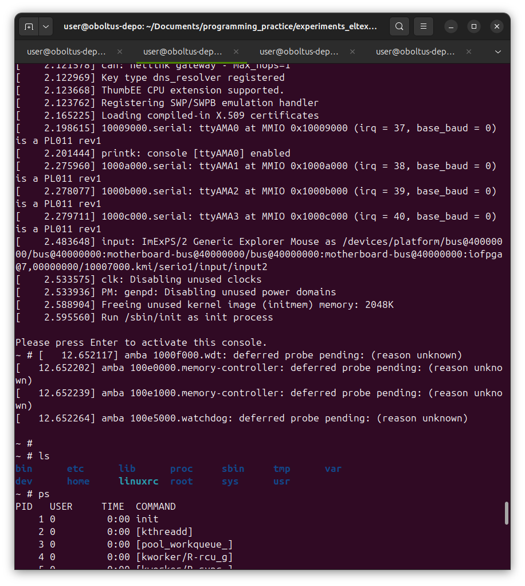
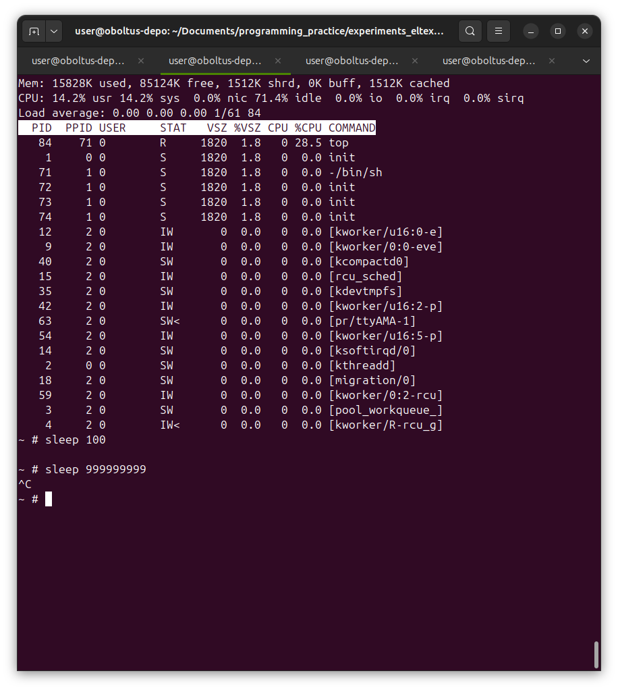
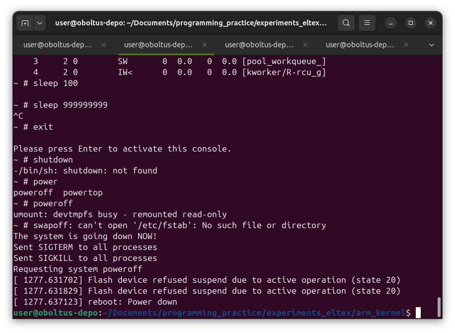

**Задание 18 - Корневая файловая система**

## Задание 1: минимальная корневая файловая система
### Самописный init
Создал самописный [init](init.c)

Скомпилировал:
```
$ arm-linux-gnueabihf-gcc -Wall -Wextra -Werror -static init.c -o init
```

Перенёс в директорию с ядром и упаковал там в архив согласно документации:
```
$ mv ./init ../../experiments_eltex/arm_kernel/
```

<details>
<summary>Нажмите, чтобы познакомиться с моей организацией директорий</summary>
Я работаю в нескольких вкладках и окнах терминала:
- **programming_practice/eltex-ibelash-homework/hw18_rootfs** <- директория с отчётом (и исходным кодом моих программ). Находится внутри репозитория со всеми остальными домашними работами.
- **programming_practice/experiments_eltex/arm_kernel** <- директория со скомпилированным ядром из предыдущего (17го) задания.
- **programming_practice/linux** <- репозиторий с исходным кодом ядра. Здесь же производится компиляция ядра.
- **programming_practice** <- тут читаются маны или производится поиск каких-либо файлов по всему коду.

Переключения между директориями происходит через вкладки или окна терминала, а не через `cd`.
Поэтому в командах появляются различные относительные пути "не связанные" между собой.
</details>

```
$ grep -nR "cpio.*gzip" linux/Documentation/
linux/Documentation/admin-guide/initrd.rst:88:	find . | cpio --quiet -H newc -o | gzip -9 -n > /boot/imagefile.img
linux/Documentation/filesystems/ramfs-rootfs-initramfs.rst:202:    (cd "$1"; find . | cpio -o -H newc | gzip) > "$2"
linux/Documentation/filesystems/ramfs-rootfs-initramfs.rst:278:  echo init | cpio -o -H newc | gzip > test.cpio.gz

# echo init | cpio -o -H newc | gzip > initramfs.cpio.gz
```

### Запуск
Далее запустил QEMU с добавлением опции -initrd:
```
$ QEMU_AUDIO_DRV=none qemu-system-armhf -M vexpress-a9 -kernel zImage -initrd initramfs.cpio.gz -dtb vexpress-v2p-ca9.dtb -append "console=ttyAMA0 " -nographic
[    0.000000] Booting Linux on physical CPU 0x0
[    0.000000] Linux version 7.0.0 (user@oboltus-depo) (arm-linux-gnueabihf-gcc (Ubuntu 13.3.0-6ubuntu2~24.04.1) 13.3.0, GNU ld (GNU Binutils for Ubuntu) 2.42) #1 SMP Sun Jun 14 20:24:07 +07 2026
[    0.000000] CPU: ARMv7 Processor [410fc090] revision 0 (ARMv7), cr=10c5387d
[    0.000000] CPU: PIPT / VIPT nonaliasing data cache, VIPT nonaliasing instruction cache
[    0.000000] OF: fdt: Machine model: V2P-CA9
[    0.000000] Memory policy: Data cache writeback
[    0.000000] efi: UEFI not found.
[    0.000000] cma: Failed to reserve 64 MiB
...
...
...
[    2.973933] input: ImExPS/2 Generic Explorer Mouse as /devices/platform/bus@40000000/bus@40000000:motherboard-bus@40000000/bus@40000000:motherboard-bus@40000000:iofpga@7,00000000/10007000.kmi/serio1/input/input2
[    3.311701] clk: Disabling unused clocks
[    3.312060] PM: genpd: Disabling unused power domains
[    3.384811] Freeing unused kernel image (initmem) memory: 2048K
[    3.395740] Run /init as init process
Это успех!
Нажмите любую клавишу для получения Kernel Panic.

[   10.470382] Kernel panic - not syncing: Attempted to kill init! exitcode=0x00000000
[   10.471724] CPU: 0 UID: 0 PID: 1 Comm: init Not tainted 7.0.0 #1 VOLUNTARY 
[   10.472361] Hardware name: ARM-Versatile Express
[   10.473069] Call trace: 
[   10.473945]  unwind_backtrace from show_stack+0x10/0x14
[   10.475467]  show_stack from dump_stack_lvl+0x54/0x68
[   10.475728]  dump_stack_lvl from vpanic+0x234/0x454
[   10.475949]  vpanic from do_panic_on_target_cpu+0x0/0x14
[   10.477316] ---[ end Kernel panic - not syncing: Attempted to kill init! exitcode=0x00000000 ]---
QEMU: Terminated
```

**Это успех!**


## Задание 2: корневая файловая система на основе Busybox

### Скачиваем BusyBox

Достаю BusyBox, а точнее, клонирую их репозиторий:
```
$ git clone git://busybox.net/busybox.git
Клонирование в «busybox»...
remote: Enumerating objects: 762, done.
remote: Counting objects: 100% (762/762), done.
remote: Compressing objects: 100% (762/762), done.
remote: Total 120312 (delta 522), reused 0 (delta 0), pack-reused 119550
Получение объектов: 100% (120312/120312), 30.54 МиБ | 1.76 МиБ/с, готово.
Определение изменений: 100% (96454/96454), готово.
```

Переключился на стабильную версию (согласно changelog на их главной странице и Wikipedia):
```
$ git switch --detach 1_36_1
HEAD сейчас на 1a64f6a20 Bump version to 1.36.1
```

### Заготовка корневой файловой системы

Создаю заготовку - набор директорий для будущей корневой файловой системы:
```
$ mkdir rootfs
$ mkdir rootfs/bin
$ mkdir rootfs/dev
$ mkdir rootfs/etc
$ mkdir rootfs/home
$ mkdir rootfs/lib
$ mkdir rootfs/proc
$ mkdir rootfs/root
$ mkdir rootfs/sbin
$ mkdir rootfs/sys
$ mkdir rootfs/tmp
$ mkdir rootfs/usr
$ mkdir rootfs/var
$ mkdir rootfs/usr/bin
$ mkdir rootfs/usr/lib
$ mkdir rootfs/usr/sbin
$ mkdir rootfs/var/log
```
\* на самом деле оно всё через Makefile создаётся.

### Конфигурация BusyBox

Создаю конфигурацию по умолчанию для BusyBox:
```
busybox$ make defconfig
  HOSTCC  scripts/basic/fixdep
  HOSTCC  scripts/basic/split-include
  HOSTCC  scripts/basic/docproc
  GEN     include/applets.h
  GEN     include/usage.h
...
...
...
  Circular Buffer support (FEATURE_IPC_SYSLOG) [Y/n/?] (NEW) y
    Circular buffer size in Kbytes (minimum 4KB) (FEATURE_IPC_SYSLOG_BUFFER_SIZE) [16] (NEW) 16
  Linux kernel printk buffer support (FEATURE_KMSG_SYSLOG) [Y/n/?] (NEW) y
```

По пути заметил, что командная оболочка только ash (sh выставлен псевдонимом для ash). Bash отключен, если я правильно понимаю.
```
...
...
...
* Shells
*
Choose which shell is aliased to 'sh' name
> 1. ash (SH_IS_ASH) (NEW)
  2. hush (SH_IS_HUSH) (NEW)
  3. none (SH_IS_NONE) (NEW)
choice[1-3?]: 1
Choose which shell is aliased to 'bash' name
  1. ash (BASH_IS_ASH) (NEW)
  2. hush (BASH_IS_HUSH) (NEW)
> 3. none (BASH_IS_NONE) (NEW)
choice[1-3?]: 3
...
...
...
```

Донастраиваю через menuconfig, чтобы результат сборки помещался в заготовку корневой файловой системы:
```
Settings    -> Build static binary (no shared libs)
            -> Cross compiler prefix = arm-linux-gnueabihf-
            -> Destination path for 'make install' = 
                ../eltex-ibelash-homework/hw18_rootfs/rootfs/
Exit
Exit
Do you wish to save your new configuration? -Yes
```

### Сборка BusyBox: попытка №1

Собираю BusyBox кросс-компилятором, который использовался для ядра:
```
$ ARCH=arm CROSS_COMPILE=arm-linux-gnueabihf- make -j$(nproc) 
  SPLIT   include/autoconf.h -> include/config/*
  GEN     include/bbconfigopts.h
  GEN     include/common_bufsiz.h
...
...
...
networking/tc.c: In function ‘cbq_print_opt’:
networking/tc.c:236:27: error: ‘TCA_CBQ_MAX’ undeclared (first use in this function); did you mean ‘TCA_CBS_MAX’?
  236 |         struct rtattr *tb[TCA_CBQ_MAX+1];
      |                           ^~~~~~~~~~~
      |                           TCA_CBS_MAX
networking/tc.c:236:27: note: each undeclared identifier is reported only once for each function it appears in
networking/tc.c:249:16: error: ‘TCA_CBQ_RATE’ undeclared (first use in this function); did you mean ‘TCA_TBF_RATE64’?
  249 |         if (tb[TCA_CBQ_RATE]) {
      |                ^~~~~~~~~~~~
      |                TCA_TBF_RATE64
  CC      coreutils/tsort.o
networking/tc.c:255:16: error: ‘TCA_CBQ_LSSOPT’ undeclared (first use in this function)
  255 |         if (tb[TCA_CBQ_LSSOPT]) {
      |                ^~~~~~~~~~~~~~
networking/tc.c:256:61: error: invalid application of ‘sizeof’ to incomplete type ‘struct tc_cbq_lssopt’
  256 |                 if (RTA_PAYLOAD(tb[TCA_CBQ_LSSOPT]) < sizeof(*lss))
      |                                                             ^
...
...
...
```

Поиск в интернете по поводу ошибок предлагает два варианта:
 - отключить Traffic Control апплет
 - применить патч

### Сборка BusyBox: попытка №2

Ещё немного почитал и выяснил, что стабильные версии в ветки выкладывают, а не с помощью тегов помечают.

Переключаюсь на ветку 1.37:
```
$ make distclean
  CLEAN   applets
  CLEAN   .tmp_versions
  CLEAN   .kernelrelease
  CLEAN   scripts/basic
  CLEAN   scripts/kconfig/lxdialog
  CLEAN   scripts/kconfig
  CLEAN   include/config
  CLEAN   .config .config.old include/NUM_APPLETS.h include/common_bufsiz.h include/autoconf.h include/bbconfigopts.h include/bbconfigopts_bz2.h include/embedded_scripts.h include/usage_compressed.h include/applet_tables.h include/applets.h include/usage.h

$ git branch -a
* (HEAD отделён на 1_36_1)
  master
  remotes/origin/0_60_stable
...
  remotes/origin/1_36_stable
  remotes/origin/1_37_stable
...
  remotes/origin/1_9_stable
  remotes/origin/HEAD -> origin/master
  remotes/origin/master

$ git switch --detach 1_37_stable
HEAD сейчас на be7d1b7b1 Bump version to 1.37.0
Эта ветка соответствует «origin/1_37_stable».
```

и пробую собрать ещё раз:
```
$ make defconfig
```

И только тут я заметил, что архитектуру-то я забыл указать. Ещё раз создаю конфигурацию по умолчанию но уже с учётом архитектуры:
```
$ make distclean
  CLEAN   .kernelrelease
  CLEAN   scripts/basic
  CLEAN   scripts/kconfig/lxdialog
  CLEAN   scripts/kconfig
  CLEAN   .config .config.old include/autoconf.h include/applets.h include/usage.h

$ ARCH=arm make defconfig
```

Снова выставляю статическую сборку, префикс кросс-компилятора и директорию для установки:
```
$ ARCH=arm make menuconfig
```

Пробую собрать:
```
$ ARCH=arm CROSS_COMPILE=arm-linux-gnueabihf- make -j$(nproc)
```

Снова с теми же ошибками по поводу Traffic Control, плюс ещё одна по поводу железной поддержки инструкций SHA:
```
libbb/hash_md5_sha.c: In function ‘sha1_end’:
libbb/hash_md5_sha.c:1316:35: error: ‘sha1_process_block64_shaNI’ undeclared (first use in this function); did you mean ‘sha1_process_block64’?
 1316 |          || ctx->process_block == sha1_process_block64_shaNI
      |                                   ^~~~~~~~~~~~~~~~~~~~~~~~~~
      |                                   sha1_process_block64
```

### Сборка BusyBox: попытка №3

Отключаю апплет Traffic Control, а также железную поддержку инструкций SHA, и пересобираю:
```
$ ARCH=arm make clean
  CLEAN   applets
  CLEAN   .tmp_versions
  CLEAN   .kernelrelease

$ ARCH=arm make menuconfig
    Settings
        -> SHA1: Use hardware accelerated instructions if possible      = N
        -> SHA256: Use hardware accelerated instructions if possible    = N
    Networking Utilities
        -> tc (8.3 kb) = N

$ ARCH=arm CROSS_COMPILE=arm-linux-gnueabihf- make -j$(nproc) 
  SPLIT   include/autoconf.h -> include/config/*
  GEN     include/bbconfigopts.h
  GEN     include/common_bufsiz.h
...
...
...
  CC      libbb/xregcomp.o
  AR      libbb/lib.a
  LINK    busybox_unstripped
Static linking against glibc, can't use --gc-sections
Trying libraries: m resolv rt
 Library m is needed, can't exclude it (yet)
 Library resolv is needed, can't exclude it (yet)
 Library rt is not needed, excluding it
 Library m is needed, can't exclude it (yet)
 Library resolv is needed, can't exclude it (yet)
Final link with: m resolv
```

### Установка BusyBox в заготовку корневой файловой системы

Устанавливаю в заготовку корневой файловой системы:
```
$ make install
  ../eltex-ibelash-homework/hw18_rootfs/rootfs///bin/arch -> busybox
  ../eltex-ibelash-homework/hw18_rootfs/rootfs///bin/ash -> busybox
  ../eltex-ibelash-homework/hw18_rootfs/rootfs///bin/base32 -> busybox
...
...
...
  ../eltex-ibelash-homework/hw18_rootfs/rootfs///usr/sbin/udhcpd -> ../../bin/busybox


--------------------------------------------------
You will probably need to make your busybox binary
setuid root to ensure all configured applets will
work properly.
--------------------------------------------------
```

Проверяю наличие файлов в заготовке корневой файловой системы:
```
hw18_rootfs$ ls -lR rootfs/
rootfs/:
итого 48
drwxrwxr-x 2 user user 4096 июн 16 20:27 bin
drwxrwxr-x 2 user user 4096 июн 16 20:27 dev
drwxrwxr-x 2 user user 4096 июн 16 20:27 etc
drwxrwxr-x 2 user user 4096 июн 16 20:27 home
drwxrwxr-x 2 user user 4096 июн 16 20:27 lib
lrwxrwxrwx 1 user user   11 июн 16 20:27 linuxrc -> bin/busybox
drwxrwxr-x 2 user user 4096 июн 16 20:27 proc
drwxrwxr-x 2 user user 4096 июн 16 20:27 root
drwxrwxr-x 2 user user 4096 июн 16 20:27 sbin
drwxrwxr-x 2 user user 4096 июн 16 20:27 sys
drwxrwxr-x 2 user user 4096 июн 16 20:27 tmp
drwxrwxr-x 5 user user 4096 июн 16 20:27 usr
drwxrwxr-x 3 user user 4096 июн 16 20:27 var

rootfs/bin:
итого 1504
lrwxrwxrwx 1 user user       7 июн 16 20:27 arch -> busybox
lrwxrwxrwx 1 user user       7 июн 16 20:27 ash -> busybox
lrwxrwxrwx 1 user user       7 июн 16 20:27 base32 -> busybox
lrwxrwxrwx 1 user user       7 июн 16 20:27 base64 -> busybox
-rwxr-xr-x 1 user user 1537868 июн 16 20:27 busybox
lrwxrwxrwx 1 user user       7 июн 16 20:27 cat -> busybox
...
...
...
```

Согласно инструкциям от Симмондса и Васкеза, создаю файлы для консоли и "чёрной дыры":
```
$ sudo mknod -m 666 rootfs/dev/null c 1 3
[sudo] пароль для user:

$ sudo mknod -m 600 rootfs/dev/console c 5 1

$ ls -l rootfs/dev/
итого 0
crw------- 1 root root 5, 1 июн 16 20:35 console
crw-rw-rw- 1 root root 1, 3 июн 16 20:35 null
```

### Создание архива корневой файловой системы

Упаковываю в архив с изменением владельца на root:root:
```
$ cd ./rootfs

$ find . | cpio -H newc -ov --owner root:root > ../initramfs.cpio
.
./lib
./etc
./bin
./bin/watch
...
...
...

$ cd ..

$ gzip initramfs.cpio

$ ls
init.c   initramfs.cpio.gz  Makefile~           README.md   rootfs
init.c~  Makefile           minimal_rootfs.png  README.md~
```

Копирую в директорию с ядром:
```
$ cd ../experiments_eltex/arm_kernel/

$ cp -av ../../eltex-ibelash-homework/hw18_rootfs/initramfs.cpio.gz ./
'../../eltex-ibelash-homework/hw18_rootfs/initramfs.cpio.gz' -> './initramfs.cpio.gz

$ ls -l
итого 13212
-rwxrwxr-x 1 user user   423744 июн 15 00:01 init
-rw-rw-r-- 1 user user  1077505 июн 16 20:39 initramfs.cpio.gz
-rw-rw-r-- 1 user user    14329 июн 14 20:44 vexpress-v2p-ca9.dtb
-rwxrwxr-x 1 user user 12001792 июн 14 20:24 zImage
```

### Запуск: попытка №1

Пробую запустить, но в качестве rdinit указываю не /bin/ash как мы на лекции делали, а /sbin/init как предлагают Симмондс и Васкез:
```
$ QEMU_AUDIO_DRV=none qemu-system-armhf -M vexpress-a9 -kernel zImage -initrd initramfs.cpio.gz -dtb vexpress-v2p-ca9.dtb -append "console=ttyAMA0 rdinit=/sbin/init" -nographic
[    0.000000] Booting Linux on physical CPU 0x0
[    0.000000] Linux version 7.0.0 (user@oboltus-depo) (arm-linux-gnueabihf-gcc (Ubuntu 13.3.0-6ubuntu2~24.04.1) 13.3.0, GNU ld (GNU Binutils for Ubuntu) 2.42) #1 SMP Sun Jun 14 20:24:07 +07 2026
[    0.000000] CPU: ARMv7 Processor [410fc090] revision 0 (ARMv7), cr=10c5387d
...
...
...
can't open /dev/tty2: No such file or directory
can't open /dev/tty4: No such file or directory
can't open /dev/tty3: No such file or directory
...
```

Получаю бесконечные попытки открыть /dev/tty2, tty3 и tty4. На `Ctrl + C` и `Ctrl + A, X` не реагирует.
В другой вкладке терминала нахожу процесс qemu и убиваю:
```
$ ps axf
    PID TTY      STAT   TIME COMMAND
      2 ?        S      0:00 [kthreadd]
      3 ?        S      0:00  \_ [pool_workqueue_release]
      4 ?        I<     0:00  \_ [kworker/R-rcu_gp]
...
...
...
   3680 ?        Ssl    1:56  \_ /usr/libexec/gnome-terminal-server
   3688 pts/0    Ss     0:00  |   \_ bash
   3708 pts/0    Sl+    0:10  |   |   \_ vim README.md
   9285 pts/1    Ss     0:00  |   \_ bash
  50331 pts/1    Sl+    0:07  |   |   \_ qemu-system-armhf -M vexpress-a9 -kernel zIm
  13051 pts/2    Ss     0:00  |   \_ bash
  50364 pts/2    R+     0:00  |       \_ ps axf
...
...
...

$ kill 50331
```

И оно останавливается:
```
...
...
...
can't open /dev/tty4: No such file or directory
can't open /dev/tty2: No such file or directory
qemu-system-armhf: terminating on signal 15 from pid 13051 (bash)
```

Также во время загрузки было следующее сообщение:
```
...
[    2.637190] Run /sbin/init as init process
can't run '/etc/init.d/rcS': No such file or directory
...
```

Хотя у Симмондса и Васкеза на 144й странице написано следующее:
> BusyBox init provides a default inittab if none is present in the root filesystem.

Видимо его надо включить... И оно уже было включено, если верить инструкциям в интернете:
```
$ grep INITTAB ./.config
CONFIG_FEATURE_USE_INITTAB=y
```

Продолжаю разбираться.

### Решение вопросов с rcS и tty2, tty3, tty4

Немного разобрался: встроенный inittab действительно уже запускается, поэтому оно и пытается загрузить файл /etc/init.d/rcS и подключиться к TTY2, TTY3, TTY4.

Решаем проблемы по одной:

### /etc/init.d/rcS
В папке **busybox/examples** никаких намёков на содержимое этого файла. 
Использую пример из Симмондса и Васкеза (стр. 144 в третьей редакции):
```
#!/bin/sh
mount -t proc proc /proc
mount -t sysfs sysfs /sys
```

Делаю его исполняемым:
```
chmod +x rootfs/etc/init.d/rcS
```

### /dev/tty2, tty3, tty4
Опять же у Симмондса и Васкеза на стр. 148 есть предложение использовать псевдо файловую систему **devtmpfs**, чтобы ядро заполняло директорию **/dev** автоматически во время загрузки.

Проверяю, включена ли эта фича:
```
$ cd ../linux/

$ grep "CONFIG_DEVTMPFS" .config
CONFIG_DEVTMPFS=y
CONFIG_DEVTMPFS_MOUNT=y
# CONFIG_DEVTMPFS_SAFE is not se
```

Да, ядро уже собрано с поддержкой **devtmpfs**.
Добавляю в **/etc/init.d/rcS** соответствущую директиву, чтобы активировать автоматическое заполнение:
```
#!/bin/sh
mount -t proc proc /proc
mount -t sysfs sysfs /sys
mount -t devtmpfs devtmpfs /dev
```

### Финал

Заново собираю архив из заготовки.
Копирую в директорию с ядром:
```
$ cp -av ../../eltex-ibelash-homework/hw18_rootfs/initramfs.cpio.gz ./
'../../eltex-ibelash-homework/hw18_rootfs/initramfs.cpio.gz' -> './initramfs.cpio.gz'
```
и запускаю:
```
$ QEMU_AUDIO_DRV=none qemu-system-armhf -M vexpress-a9 -kernel zImage -initrd initramfs.cpio.gz -dtb vexpress-v2p-ca9.dtb -append "console=ttyAMA0 rdinit=/sbin/init" -nographic
[    0.000000] Booting Linux on physical CPU 0x0
[    0.000000] Linux version 7.0.0 (user@oboltus-depo) (arm-linux-gnueabihf-gcc (Ubuntu 13.3.0-6ubuntu2~24.04.1) 13.3.0, GNU ld (GNU Binutils for Ubuntu) 2.42) #1 SMP Sun Jun 14 20:24:07 +07 2026
[    0.000000] CPU: ARMv7 Processor [410fc090] revision 0 (ARMv7), cr=10c5387d
...
...
...
[    2.588904] Freeing unused kernel image (initmem) memory: 2048K
[    2.595560] Run /sbin/init as init process

Please press Enter to activate this console. 
```





`ps` работает из коробки:
```
~ # ps
PID   USER     TIME  COMMAND
    1 0         0:00 init
    2 0         0:00 [kthreadd]
    3 0         0:00 [pool_workqueue_]
    4 0         0:00 [kworker/R-rcu_g]
    5 0         0:00 [kworker/R-sync_]
...
   66 0         0:00 [kworker/0:3]
   71 0         0:00 -/bin/sh
   72 0         0:00 init
   73 0         0:00 init
   74 0         0:00 init
   76 0         0:00 ps
```

**/dev** заполнено:
```
~ # ls /dev/
autofs           ptys8            tty3             ttyr1
console          ptys9            tty30            ttyr2
cpu_dma_latency  ptysa            tty31            ttyr3
full             ptysb            tty32            ttyr4
gpiochip0        ptysc            tty33            ttyr5
....
....
....
ptys3            tty25            ttyqc            vcsu3
ptys4            tty26            ttyqd            vcsu4
ptys5            tty27            ttyqe            vga_arbiter
ptys6            tty28            ttyqf            zero
ptys7            tty29            ttyr0

# ls /dev/ | wc -l
651
```
\* Даже переполнено. У меня на хосте с Ubuntu всего 230 файлов в **/dev**.

И завершение через `Ctrl + C` работает. 



Это успех!

Машину даже выключить можно:



