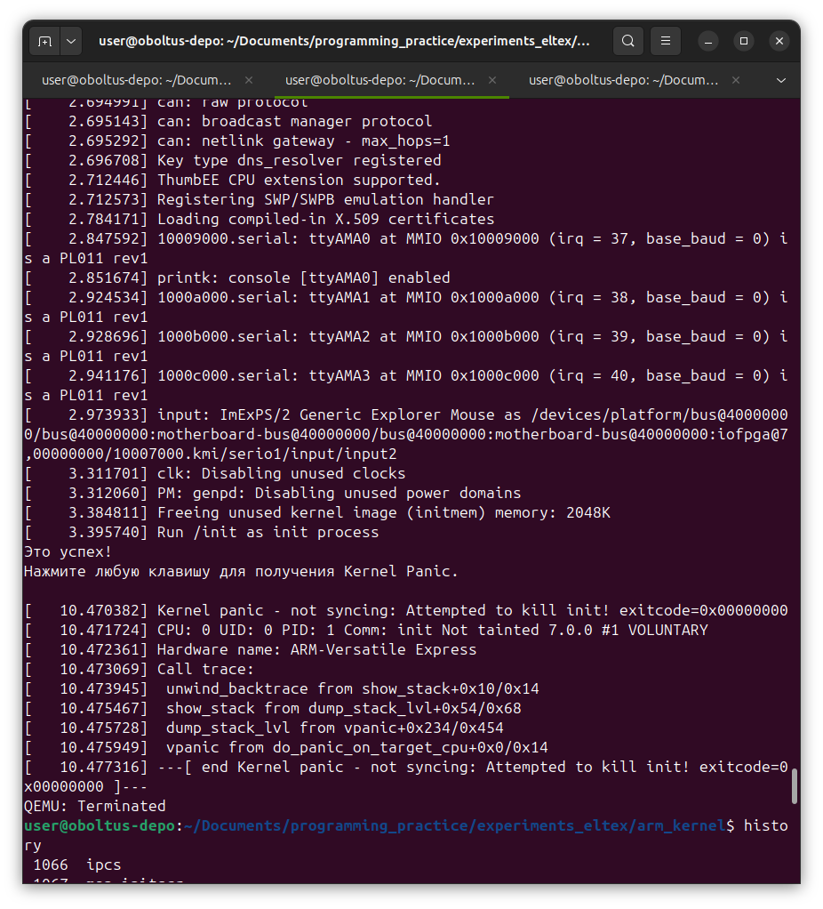

**Задание 18 - Корневая файловая система**

## Задание 1: минимальная корневая файловая система

Создал самописный [init](init.c)

Скомпилировал:
```
$ arm-linux-gnueabihf-gcc -Wall -Wextra -Werror -static init.c -o init
```

Перенёс в директорию с ядром и упаковал там в архив согласно документации:
```
$ mv ./init ../../experiments_eltex/arm_kernel/
```


Я работаю в нескольких вкладках терминала:
- **programming_practice/eltex-ibelash-homework/hw18_rootfs** <- репозиторий с отчётом и исходным кодом.
- **programming_practice/experiments_eltex/arm_kernel** <- директория с ядром из предыдущего задания.
- **programming_practice** <- тут читаются маны или идёт поиск каких-либо файлов.

Переключения между директориями происходит через вкладки терминала, а не через cd.
Поэтому в командах появляются различные относительные пути "не связанные" между собой.


```
$ grep -nR "cpio.*gzip" linux/Documentation/
linux/Documentation/admin-guide/initrd.rst:88:	find . | cpio --quiet -H newc -o | gzip -9 -n > /boot/imagefile.img
linux/Documentation/filesystems/ramfs-rootfs-initramfs.rst:202:    (cd "$1"; find . | cpio -o -H newc | gzip) > "$2"
linux/Documentation/filesystems/ramfs-rootfs-initramfs.rst:278:  echo init | cpio -o -H newc | gzip > test.cpio.gz

# echo init | cpio -o -H newc | gzip > initramfs.cpio.gz
```

Далее запустил QEMU с добавлением опции -initrd:
```
$ QEMU_AUDIO_DRV=none qemu-system-armhf -M vexpress-a9 -kernel zImage -initrd initramfs.cpio.gz -dtb vexpress-v2p-ca9.dtb -append "console=ttyAMA0 " -nographic
[    0.000000] Booting Linux on physical CPU 0x0
[    0.000000] Linux version 7.0.0 (user@oboltus-depo) (arm-linux-gnueabihf-gcc (Ubuntu 13.3.0-6ubuntu2~24.04.1) 13.3.0, GNU ld (GNU Binutils for Ubuntu) 2.42) #1 SMP Sun Jun 14 20:24:07 +07 2026
[    0.000000] CPU: ARMv7 Processor [410fc090] revision 0 (ARMv7), cr=10c5387d
[    0.000000] CPU: PIPT / VIPT nonaliasing data cache, VIPT nonaliasing instruction cache
[    0.000000] OF: fdt: Machine model: V2P-CA9
[    0.000000] Memory policy: Data cache writeback
[    0.000000] efi: UEFI not found.
[    0.000000] cma: Failed to reserve 64 MiB
...
...
...
[    2.973933] input: ImExPS/2 Generic Explorer Mouse as /devices/platform/bus@40000000/bus@40000000:motherboard-bus@40000000/bus@40000000:motherboard-bus@40000000:iofpga@7,00000000/10007000.kmi/serio1/input/input2
[    3.311701] clk: Disabling unused clocks
[    3.312060] PM: genpd: Disabling unused power domains
[    3.384811] Freeing unused kernel image (initmem) memory: 2048K
[    3.395740] Run /init as init process
Это успех!
Нажмите любую клавишу для получения Kernel Panic.

[   10.470382] Kernel panic - not syncing: Attempted to kill init! exitcode=0x00000000
[   10.471724] CPU: 0 UID: 0 PID: 1 Comm: init Not tainted 7.0.0 #1 VOLUNTARY 
[   10.472361] Hardware name: ARM-Versatile Express
[   10.473069] Call trace: 
[   10.473945]  unwind_backtrace from show_stack+0x10/0x14
[   10.475467]  show_stack from dump_stack_lvl+0x54/0x68
[   10.475728]  dump_stack_lvl from vpanic+0x234/0x454
[   10.475949]  vpanic from do_panic_on_target_cpu+0x0/0x14
[   10.477316] ---[ end Kernel panic - not syncing: Attempted to kill init! exitcode=0x00000000 ]---
QEMU: Terminated
```

**Это успех!**



