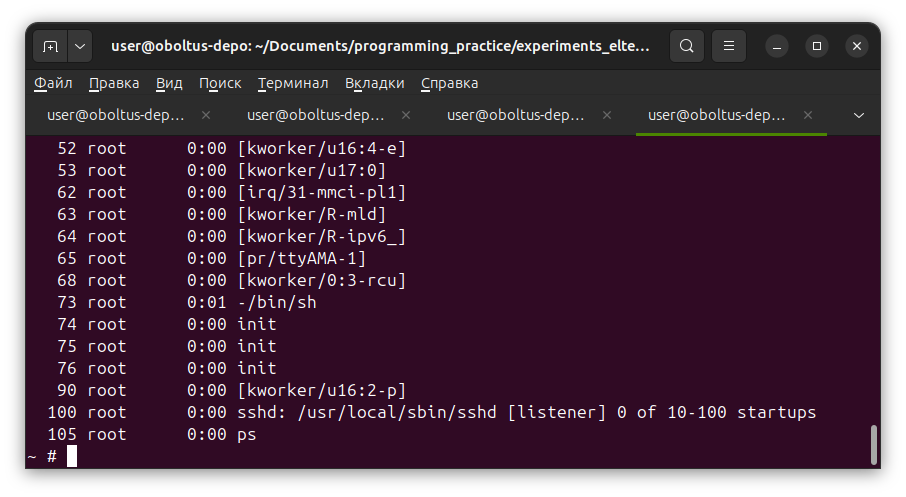

**Задание 19 - Кросс-компиляция пакетов**

## Достаём исходный код

Клонирую репозитории OpenSSH, OpenSSL, Zlib в виде подмодулей этого репозитория:
```
$ git submodule add git@github.com:openssh/openssh-portable.git
Клонирование в «/home/user/Documents/programming_practice/eltex-ibelash-homework/hw19_package_cross-compilation/openssh-portable»...
remote: Enumerating objects: 72326, done.
remote: Counting objects: 100% (200/200), done.
remote: Compressing objects: 100% (97/97), done.
remote: Total 72326 (delta 140), reused 117 (delta 103), pack-reused 72126 (from 3)
Получение объектов: 100% (72326/72326), 33.31 МиБ | 5.34 МиБ/с, готово.
Определение изменений: 100% (55987/55987), готово.

$ git submodule add git@github.com:openssl/openssl.git
Клонирование в «/home/user/Documents/programming_practice/eltex-ibelash-homework/hw19_package_cross-compilation/openssl»...
remote: Enumerating objects: 562009, done.
remote: Counting objects: 100% (628/628), done.
remote: Compressing objects: 100% (300/300), done.
remote: Total 562009 (delta 448), reused 328 (delta 328), pack-reused 561381 (from 2)
Получение объектов: 100% (562009/562009), 334.97 МиБ | 10.90 МиБ/с, готово.
Определение изменений: 100% (416987/416987), готово.

$ git submodule add git@github.com:madler/zlib.git
Клонирование в «/home/user/Documents/programming_practice/eltex-ibelash-homework/hw19_package_cross-compilation/zlib»...
remote: Enumerating objects: 9045, done.
remote: Counting objects: 100% (117/117), done.
remote: Compressing objects: 100% (19/19), done.
remote: Total 9045 (delta 106), reused 98 (delta 98), pack-reused 8928 (from 2)
Получение объектов: 100% (9045/9045), 4.91 МиБ | 6.47 МиБ/с, готово.
Определение изменений: 100% (6459/6459), готово.
```

## Сборка Zlib

### Конфигурация

Познакомился с порядком передачи параметров:
```
$ head -n15 ./zlib/configure 
#!/bin/sh
# configure script for zlib.
#
# Normally configure builds both a static and a shared library.
# If you want to build just a static library, use: ./configure --static
#
# To impose specific compiler or flags or install directory, use for example:
#    prefix=$HOME CC=cc CFLAGS="-O4" ./configure
# or for csh/tcsh users:
#    (setenv prefix $HOME; setenv CC cc; setenv CFLAGS "-O4"; ./configure)

# Incorrect settings of CC or CFLAGS may prevent creating a shared library.
# If you have problems, try without defining CC and CFLAGS before reporting
# an error.
```

Установку я собираюсь делать сразу в заготовку корневой файловой системы из предыдущего задания, соответственно **prefix=$PWD/../../hw18\_rootfs/rootfs**.

Запускаю конфигурацию с учётом информации выше:

```
$ cd zlib

zlib$ prefix=$PWD/../../hw18_rootfs/rootfs CC=arm-linux-gnueabihf-gcc CFLAGS="-Wall -Wextra -Werror" ./configure --static
Building static library libz.a version 1.3.2.1-motley with arm-linux-gnueabihf-gcc.
Checking for size_t... Yes.
Checking for off64_t... Yes.
Checking for fseeko... Yes.
Checking for strerror... Yes.
Checking for unistd.h... Yes.
Checking for stdarg.h... Yes.
Checking whether to use vs[n]printf() or s[n]printf()... using vs[n]printf().
Checking for vsnprintf() in stdio.h... Yes.
Checking for return value of vsnprintf()... Yes.
Checking for attribute(visibility) support... Yes.
Checking for s390x build ... No. 
```

Вижу, что Makefile изменился:
```
zlib$ git status
Текущая ветка: develop
Эта ветка соответствует «origin/develop».

Изменения, которые не в индексе для коммита:
  (используйте «git add <файл>...», чтобы добавить файл в индекс)
  (используйте «git restore <файл>...», чтобы отменить изменения в рабочем каталоге)
	изменено:      Makefile
	изменено:      zconf.h

индекс пуст (используйте «git add» и/или «git commit -a»)
```


### Сборка и установка

Собираю:

```
$ make
arm-linux-gnueabihf-gcc -Wall -Wextra -Werror -fPIC -D_LARGEFILE64_SOURCE=1 -DHAVE_HIDDEN -I. -c -o example.o test/example.c
arm-linux-gnueabihf-gcc -Wall -Wextra -Werror -fPIC -D_LARGEFILE64_SOURCE=1 -DHAVE_HIDDEN  -c -o adler32.o adler32.c
arm-linux-gnueabihf-gcc -Wall -Wextra -Werror -fPIC -D_LARGEFILE64_SOURCE=1 -DHAVE_HIDDEN  -c -o crc32.o crc32.c
arm-linux-gnueabihf-gcc -Wall -Wextra -Werror -fPIC -D_LARGEFILE64_SOURCE=1 -DHAVE_HIDDEN  -c -o deflate.o deflate.c
arm-linux-gnueabihf-gcc -Wall -Wextra -Werror -fPIC -D_LARGEFILE64_SOURCE=1 -DHAVE_HIDDEN  -c -o infback.o infback.c
arm-linux-gnueabihf-gcc -Wall -Wextra -Werror -fPIC -D_LARGEFILE64_SOURCE=1 -DHAVE_HIDDEN  -c -o inffast.o inffast.c
arm-linux-gnueabihf-gcc -Wall -Wextra -Werror -fPIC -D_LARGEFILE64_SOURCE=1 -DHAVE_HIDDEN  -c -o inflate.o inflate.c
arm-linux-gnueabihf-gcc -Wall -Wextra -Werror -fPIC -D_LARGEFILE64_SOURCE=1 -DHAVE_HIDDEN  -c -o inftrees.o inftrees.c
arm-linux-gnueabihf-gcc -Wall -Wextra -Werror -fPIC -D_LARGEFILE64_SOURCE=1 -DHAVE_HIDDEN  -c -o trees.o trees.c
arm-linux-gnueabihf-gcc -Wall -Wextra -Werror -fPIC -D_LARGEFILE64_SOURCE=1 -DHAVE_HIDDEN  -c -o zutil.o zutil.c
arm-linux-gnueabihf-gcc -Wall -Wextra -Werror -fPIC -D_LARGEFILE64_SOURCE=1 -DHAVE_HIDDEN  -c -o compress.o compress.c
arm-linux-gnueabihf-gcc -Wall -Wextra -Werror -fPIC -D_LARGEFILE64_SOURCE=1 -DHAVE_HIDDEN  -c -o uncompr.o uncompr.c
arm-linux-gnueabihf-gcc -Wall -Wextra -Werror -fPIC -D_LARGEFILE64_SOURCE=1 -DHAVE_HIDDEN  -c -o gzclose.o gzclose.c
arm-linux-gnueabihf-gcc -Wall -Wextra -Werror -fPIC -D_LARGEFILE64_SOURCE=1 -DHAVE_HIDDEN  -c -o gzlib.o gzlib.c
arm-linux-gnueabihf-gcc -Wall -Wextra -Werror -fPIC -D_LARGEFILE64_SOURCE=1 -DHAVE_HIDDEN  -c -o gzread.o gzread.c
arm-linux-gnueabihf-gcc -Wall -Wextra -Werror -fPIC -D_LARGEFILE64_SOURCE=1 -DHAVE_HIDDEN  -c -o gzwrite.o gzwrite.c
ar rc libz.a adler32.o crc32.o deflate.o infback.o inffast.o inflate.o inftrees.o trees.o zutil.o compress.o uncompr.o gzclose.o gzlib.o gzread.o gzwrite.o 
arm-linux-gnueabihf-gcc -Wall -Wextra -Werror -fPIC -D_LARGEFILE64_SOURCE=1 -DHAVE_HIDDEN  -o example example.o -L. libz.a
arm-linux-gnueabihf-gcc -Wall -Wextra -Werror -fPIC -D_LARGEFILE64_SOURCE=1 -DHAVE_HIDDEN -I. -c -o minigzip.o test/minigzip.c
arm-linux-gnueabihf-gcc -Wall -Wextra -Werror -fPIC -D_LARGEFILE64_SOURCE=1 -DHAVE_HIDDEN  -o minigzip minigzip.o -L. libz.a
arm-linux-gnueabihf-gcc -Wall -Wextra -Werror -fPIC -D_LARGEFILE64_SOURCE=1 -DHAVE_HIDDEN -I. -D_FILE_OFFSET_BITS=64 -c -o example64.o test/example.c
arm-linux-gnueabihf-gcc -Wall -Wextra -Werror -fPIC -D_LARGEFILE64_SOURCE=1 -DHAVE_HIDDEN  -o example64 example64.o -L. libz.a
arm-linux-gnueabihf-gcc -Wall -Wextra -Werror -fPIC -D_LARGEFILE64_SOURCE=1 -DHAVE_HIDDEN -I. -D_FILE_OFFSET_BITS=64 -c -o minigzip64.o test/minigzip.c
arm-linux-gnueabihf-gcc -Wall -Wextra -Werror -fPIC -D_LARGEFILE64_SOURCE=1 -DHAVE_HIDDEN  -o minigzip64 minigzip64.o -L. libz.a
```

Проверяем, что действительно собрали для ARM:

```
zlib$ file trees.o
trees.o: ELF 32-bit LSB relocatable, ARM, EABI5 version 1 (SYSV), not stripped
```

Устанавливаем:

```
$ make install
rm -f /home/user/Documents/programming_practice/eltex-ibelash-homework/hw19_package_cross-compilation/zlib/../../hw18_rootfs/rootfs/lib/libz.a
cp libz.a /home/user/Documents/programming_practice/eltex-ibelash-homework/hw19_package_cross-compilation/zlib/../../hw18_rootfs/rootfs/lib
chmod 644 /home/user/Documents/programming_practice/eltex-ibelash-homework/hw19_package_cross-compilation/zlib/../../hw18_rootfs/rootfs/lib/libz.a
rm -f /home/user/Documents/programming_practice/eltex-ibelash-homework/hw19_package_cross-compilation/zlib/../../hw18_rootfs/rootfs/share/man/man3/zlib.3
cp zlib.3 /home/user/Documents/programming_practice/eltex-ibelash-homework/hw19_package_cross-compilation/zlib/../../hw18_rootfs/rootfs/share/man/man3
chmod 644 /home/user/Documents/programming_practice/eltex-ibelash-homework/hw19_package_cross-compilation/zlib/../../hw18_rootfs/rootfs/share/man/man3/zlib.3
rm -f /home/user/Documents/programming_practice/eltex-ibelash-homework/hw19_package_cross-compilation/zlib/../../hw18_rootfs/rootfs/lib/pkgconfig/zlib.pc
cp zlib.pc /home/user/Documents/programming_practice/eltex-ibelash-homework/hw19_package_cross-compilation/zlib/../../hw18_rootfs/rootfs/lib/pkgconfig
chmod 644 /home/user/Documents/programming_practice/eltex-ibelash-homework/hw19_package_cross-compilation/zlib/../../hw18_rootfs/rootfs/lib/pkgconfig/zlib.pc
rm -f /home/user/Documents/programming_practice/eltex-ibelash-homework/hw19_package_cross-compilation/zlib/../../hw18_rootfs/rootfs/include/zlib.h /home/user/Documents/programming_practice/eltex-ibelash-homework/hw19_package_cross-compilation/zlib/../../hw18_rootfs/rootfs/include/zconf.h
cp zlib.h zconf.h /home/user/Documents/programming_practice/eltex-ibelash-homework/hw19_package_cross-compilation/zlib/../../hw18_rootfs/rootfs/include
chmod 644 /home/user/Documents/programming_practice/eltex-ibelash-homework/hw19_package_cross-compilation/zlib/../../hw18_rootfs/rootfs/include/zlib.h /home/user/Documents/programming_practice/eltex-ibelash-homework/hw19_package_cross-compilation/zlib/../../hw18_rootfs/rootfs/include/zconf.h
``` 


## Сборка OpenSSL

### Конфигурация
Искал информацию по поводу кросс-компиляции в директориях самого пакета. Пробежался по HOWTO.md, INSTALL.md, заглянул в ./doc/, и наконец:

```
$ grep -iR "cross-compile"
test/recipes/80-test_cmp_http.t:plan skip_all => "Tests involving local HTTP server not available in cross-compile builds"
INSTALL.md:   - [Cross Compile Prefix](#cross-compile-prefix)
INSTALL.md:    --cross-compile-prefix=<PREFIX>
INSTALL.md:target on Linux `--cross-compile-prefix=x86_64-w64-mingw32-` works.  Naturally
INSTALL.md:have option to install a number of prepackaged cross-compilers along with
INSTALL.md:another example `--cross-compile-prefix=mipsel-linux-gnu-` suffices in such
INSTALL.md:                   "--cross-compile-prefix" Configure flag described above. If both
...
...
...
```

Также в INSTALL.md следующая информация о кросс-компиляции:

> For cross compilation, you must [configure manually](#manual-configuration).
...
> OpenSSL knows about a range of different operating system, hardware and
> compiler combinations.  To see the ones it knows about, run
> 
>     $ ./Configure LIST

Проверяю, есть ли наша платформа в списке известных:

```
$ ./Configure LIST | grep arm
BSD-armv4
android-arm
android-arm64
android-armeabi
darwin64-arm64
darwin64-arm64-cc
iossimulator-arm64-xcrun
linux-arm64ilp32
linux-arm64ilp32-clang
linux-armv4
mingwarm64
```

Казалось бы нашей платформы нет, но интернет говорит, что **linux-armv4** 
в терминах OpenSSL соответствует не только старым, но и новым чипам, 
включая ARMv7 под который мы решили собирать ядро в 17м домашнем задании.

Как доказательство этого нашёл следующую часть конфигурации:

```
openssl$ grep -inR -A2 gnueabihf
.github/workflows/cross-compiles.yml:67:            arch: arm-linux-gnueabihf,
.github/workflows/cross-compiles.yml-68-            libs: libc6-dev-armhf-cross,
.github/workflows/cross-compiles.yml-69-            target: linux-armv4,
```

С учётом этого, запускаю конфигурацию:
```
openssl$ ./Configure linux-armv4 --prefix=$PWD/../../hw18_rootfs/rootfs --cross-compile-prefix=arm-linux-gnueabihf- 
Configuring OpenSSL version 4.1.0-dev for target linux-armv4
Using os-specific seed configuration
Created configdata.pm
Running configdata.pm
Created Makefile.in
Created Makefile

**********************************************************************
***                                                                ***
***   OpenSSL has been successfully configured                     ***
***                                                                ***
***   If you encounter a problem while building, please open an    ***
***   issue on GitHub <https://github.com/openssl/openssl/issues>  ***
***   and include the output from the following command:           ***
***                                                                ***
***       perl configdata.pm --dump                                ***
***                                                                ***
***   (If you are new to OpenSSL, you might want to consult the    ***
***   'Troubleshooting' section in the INSTALL.md file first)      ***
***                                                                ***
**********************************************************************
```


### Сборка и установка
Пытаюсь собрать:
```
openssl$ make
```

Запускаю тесты:
```
openssl$ make test
...
...
...
arm-binfmt-P: Could not open '/lib/ld-linux-armhf.so.3': No such file or directory
../../util/wrap.pl ../../test/byteorder_test => 255
not ok 1 - running byteorder_test
# ------------------------------------------------------------------------------
#   Failed test 'running byteorder_test'
#   at /home/user/Documents/programming_practice/eltex-ibelash-homework/hw19_package_cross-compilation/openssl/util/perl/OpenSSL/Test/Simple.pm line 77.
# Looks like you failed 1 test of 1.[12:47:41] 02-test_byteorder.t ...................... 
Dubious, test returned 1 (wstat 256, 0x100)
Failed 1/1 subtests 
...
...
...
  Failed tests:  2-3, 9-11, 13-22
Files=187, Tests=1032, 20 wallclock secs ( 1.93 usr  0.41 sys + 60.71 cusr 14.16 csys = 77.21 CPU)
Result: FAIL
FAILED--Further testing stopped: Could not open key file: No such file or directory
make[2]: *** [Makefile:4056: run_tests] Error 13
...
```

Интернет говорит, что это потому что не указана **--openssldir**.

### Конфигурация, сборка и установка - попытка №2

Очищаю и перезапускаю конфигурацию:
```
openssl$ make distclean
rm -f libcrypto.so.4
rm -f libcrypto.so
rm -f libssl.so.4
...
...
...
rm -f include/openssl/configuration.h
rm -f configdata.pm
rm -f Makefile

openssl$ ./Configure linux-armv4 --prefix=$PWD/../../hw18_rootfs/rootfs --openssldir=$PWD/../../hw18_rootfs/rootfs --cross-compile-prefix=arm-linux-gnueabihf-
```

Собираю:
```
openssl$ make -j$(nproc)
```

Тесты снова падают с теми же ошибками.
Интернет говорит, что это ожидаемо, так как `make test` должно запускаться на целевой архитектуре. Продолжаю.
```
openssl$ make install

openssl$ ls -l ../../hw18_rootfs/rootfs/lib/
итого 12992
drwxrwxr-x 3 user user    4096 июн 18 14:32 cmake
-rw-r--r-- 1 user user 6803570 июн 18 14:32 libcrypto.a
lrwxrwxrwx 1 user user      14 июн 18 14:32 libcrypto.so -> libcrypto.so.4
-rwxr-xr-x 1 user user 4102416 июн 18 14:32 libcrypto.so.4
-rw-r--r-- 1 user user 1348924 июн 18 14:32 libssl.a
lrwxrwxrwx 1 user user      11 июн 18 14:32 libssl.so -> libssl.so.4
-rwxr-xr-x 1 user user  916288 июн 18 14:32 libssl.so.4
-rw-r--r-- 1 user user  108774 июн 18 00:55 libz.a
drwxrwxr-x 2 user user    4096 июн 18 14:32 ossl-modules
drwxrwxr-x 2 user user    4096 июн 18 14:32 pkgconfig
```

Проверяю, что результирующие файлы собраны под ARM:

```
$ file ../../hw18_rootfs/rootfs/lib/libcrypto.so.4
../../hw18_rootfs/rootfs/lib/libcrypto.so.4: ELF 32-bit LSB shared object, ARM, EABI5 version 1 (SYSV), dynamically linked, BuildID[sha1]=fc59568964357c93c45f1f6733464b0acf78068f, not stripped
```


## Сборка OpenSSH

### Конфигурация (попытка №1)

Файла **./configure** не существует. Согласно **INSTALL** необходимо запустить **autoreconf** для его создания:
```
openssh-portable$ autoreconf
```

Запускаем конфигурацию:

```
openssh-portable$ ./configure --host=arm-linux-gnueabihf --with-zlib=$PWD/../../hw18_rootfs/rootfs/ --with-ssl-dir=$PWD/../../hw18_rootfs/rootfs/ --prefix=$PWD/../../hw18_rootfs/rootfs/
checking for arm-linux-gnueabihf-cc... no
checking for arm-linux-gnueabihf-gcc... arm-linux-gnueabihf-gcc
checking whether the C compiler works... yes
...
...
...
checking for zlib... yes
checking for zlib.h... yes
checking for deflate in -lz... yes
checking for possibly buggy zlib... configure: WARNING: cross compiling: not checking zlib version
...
...
...
checking for openssl... /usr/bin/openssl
checking for openssl/opensslv.h... yes
checking OpenSSL header version... configure: WARNING: cross compiling: not checking
checking for OpenSSL_version... yes
checking for OpenSSL_version_num... yes
checking OpenSSL library version... configure: WARNING: cross compiling: not checking
checking whether OpenSSL's headers match the library... configure: WARNING: cross compiling: not checking
checking if programs using OpenSSL functions will link... yes
...
...
...
```


### Сборка и установка

Запускаю сборку:
```
openssh-portable$ make

openssh-portable$ make install
...
...
...
/usr/bin/mkdir -p /home/user/Documents/programming_practice/eltex-ibelash-homework/hw19_package_cross-compilation/openssh-portable/../../hw18_rootfs/rootfs/libexec
/usr/bin/mkdir -p -m 0755 /var/empty
/usr/bin/mkdir: невозможно создать каталог «/var/empty»: Отказано в доступе
make: *** [Makefile:439: install-files] Ошибка 1
```

Прервалось с тем, что невозможно создать **/var/empty** - судя по всему на домашней машине, а не в заготовке корневой файловой системы.

Насколько я понял, проблема в том, что для конкретно этой директории префикс не выставляется. Выставляю вручную:
```
openssh-portable$ cp -a Makefile{,.backup}

openssh-portable$ vim Makefile

openssh-portable$ diff Makefile Makefile.backup 
439c439
< 	$(MKDIR_P) -m 0755 $(DESTDIR)${prefix}$(PRIVSEP_PATH)
---
> 	$(MKDIR_P) -m 0755 $(DESTDIR)$(PRIVSEP_PATH)
```

Теперь падает со следующей ошибкой:
```
/usr/bin/install -c -m 0755 -s ssh /home/user/Documents/programming_practice/eltex-ibelash-homework/hw19_package_cross-compilation/openssh-portable/../../hw18_rootfs/rootfs/bin/ssh
strip: Невозможно определить формат входного файла «/home/user/Documents/programming_practice/eltex-ibelash-homework/hw19_package_cross-compilation/openssh-portable/../../hw18_rootfs/rootfs/bin/ssh»
/usr/bin/install: процесс strip завершился неудачно
make: *** [Makefile:440: install-files] Ошибка 1
```

Немного погуглив дохожу до того, что опцию **--prefix** надо указывать для локальной установки. 
А в случае кросс-компиляции на этапе `make install` надо использовать переменную **DESTDIR**.

### Конфигурация заново без --prefix (попытка №2)

Очищаем:
```
openssh-portable$ make distclean
```

Запускаем конфигурацию:
```
openssh-portable$ ./configure --host=arm-linux-gnueabihf --with-zlib=$PWD/../../hw18_rootfs/rootfs --with-ssl-dir=$PWD/../../hw18_rootfs/rootfs
```

### Сборка и установка (попытка №2)

Сборка:
```
openssh-portable$ make -j$(nproc)
```

Установка:
```
openssh-portable$ make DESTDIR=../../hw18_rootfs/rootfs install
...
...
...
/usr/bin/install -c -m 0755 -s ssh ../../hw18_rootfs/rootfs/usr/local/bin/ssh
strip: Невозможно определить формат входного файла «../../hw18_rootfs/rootfs/usr/local/bin/ssh»
/usr/bin/install: процесс strip завершился неудачно
make: *** [Makefile:440: install-files] Ошибка 1
```

Опять падает с той же ошибкой... А всё потому что используется strip от x86\_64 вместо ARM.
В мануале на `install` есть опция позволяющая указать утилиту вместо `strip`:
```
$ man install | grep strip
       -s, --strip
              strip symbol tables
       --strip-program=PROGRAM
              program used to strip binaries
```

Не увидел аналогичной опции для `./configure`. Поэтому правлю Makefile руками:
```
openssh-portable$ cp -a Makefile{,.backup}

openssh-portable$ vim Makefile

openssh-portable$ diff Makefile{,.backup}
32c32
< STRIP_OPT=-s --strip-program=arm-linux-gnueabihf-strip
---
> STRIP_OPT=-s
```
\* Потом догадался, что можно было переменную STRIP\_OPT переопределить во время запуска.


Запускаю установку:
```
openssh-portable$ make DESTDIR=../../hw18_rootfs/rootfs install
...
...
...
/usr/bin/mkdir -p -m 0755 ../../hw18_rootfs/rootfs/var/empty
/usr/bin/install -c -m 0755 -s --strip-program=arm-linux-gnueabihf-strip ssh ../../hw18_rootfs/rootfs/usr/local/bin/ssh
/usr/bin/install -c -m 0755 -s --strip-program=arm-linux-gnueabihf-strip scp ../../hw18_rootfs/rootfs/usr/local/bin/scp
...
...
...
/usr/bin/mkdir -p ../../hw18_rootfs/rootfs/usr/local/etc
../../hw18_rootfs/rootfs/usr/local/sbin/sshd -t -f ../../hw18_rootfs/rootfs/usr/local/etc/sshd_config
arm-binfmt-P: Could not open '/lib/ld-linux-armhf.so.3': No such file or directory
make: [Makefile:430: check-config] Ошибка 255 (игнорирование)
```

Опять упало из-за **/lib/ld-linux-armhf.so.3**. Я запустил с дебагом (make -d) и понял, 
что это из-за того, что оно пытается запустить исполняемые файлы для создание конфигурационных файлов.

Чтобы этой ошибки не выдавало, надо указывать цель **install-nokeys**:
```
openssh-portable$ make DESTDIR=../../hw18_rootfs/rootfs install-nokeys
```

Проверил, что исполняемые файлы были успешно скопированы:
```
rootfs$ ls -l ./usr/local/bin/
итого 2340
-rwxr-xr-x 1 user user 149136 июн 18 17:50 scp
-rwxr-xr-x 1 user user 153212 июн 18 17:50 sftp
-rwxr-xr-x 1 user user 714584 июн 18 17:50 ssh
-rwxr-xr-x 1 user user 292364 июн 18 17:50 ssh-add
-rwxr-xr-x 1 user user 280068 июн 18 17:50 ssh-agent
-rwxr-xr-x 1 user user 374360 июн 18 17:50 ssh-keygen
-rwxr-xr-x 1 user user 415412 июн 18 17:50 ssh-keyscan
```


## Упаковка корневой файловой системы

Упаковываем:
```
$ cd ../../hw18_rootfs/rootfs/

$ find . | cpio -H newc -ov --owner root:root > ../initramfs.cpio

$ cd ..

$ gzip initramfs.cpio
```

Копируем к нашему ядру:
```
$ cp -a initramfs.cpio.gz ../../experiments_eltex/arm_kernel/
```


## Запуск

### Попытка №1
Момент истины:
```
$ cd ../../experiments_eltex/arm_kernel/

$ QEMU_AUDIO_DRV=none qemu-system-armhf -M vexpress-a9 -kernel zImage -initrd initra
mfs.cpio.gz -dtb vexpress-v2p-ca9.dtb -append "console=ttyAMA0 rdinit=/sbin/init" -n
ographic
...
...
...
~ # /usr/local/bin/ssh-keygen 
-/bin/sh: /usr/local/bin/ssh-keygen: not found
```

В интернете говорят, что это из-за отсутствующих библиотек. 
Ну и у нас были проблемы с **/lib/ld-linux-armhf.so.3**. 

### Попытка №2

Копирую **ld-linux-armhf.so.3** в заготовку файловой системы:
```
$ cp -a /usr/arm-linux-gnueabihf/lib/ld-linux-armhf.so.3 rootfs/lib/
```

Упаковываю и копирую архив с корневой файловой системой к ядру, и запускаю:
```
...
...
...
~ # /usr/local/bin/ssh-keygen 
/usr/local/bin/ssh-keygen: error while loading shared libraries: libc.so.6: cannot open shared object file: No such file or directory
```

### Попытка №3
Я на правильном пути:
```
$ cp -a /usr/arm-linux-gnueabihf/lib/libc.so.6 rootfs/lib/
```

Упаковываю, копирую, запускаю:

```
...
...
...
~ # /usr/local/bin/ssh-keygen 
[   33.048271] random: crng init done
No user exists for uid 0

~ # /usr/local/sbin/sshd 
sshd: no hostkeys available -- exiting.
```

Создаю пользователя root:
```
~ # adduser -h /root -s /bin/ash -H -u 0 root root
adduser: /etc/passwd: No such file or directory
~ # touch /etc/passwd
~ # adduser -h /root -s /bin/ash -H -u 0 root root
addgroup: /etc/group: No such file or directory
Changing password for root
New password: 
Bad password: too short
Retype password: 
passwd: password for root changed by root
```

Ещё раз запускаю генерацию ключей:
```
~ # /usr/local/bin/ssh-keygen -A
ssh-keygen: generating new host keys: RSA 
ECDSA ED25519 MLDSA44-ED25519
```

### Успешный запуск sshd

Ну и наконец стартуем sshd:
```
~ # /usr/local/sbin/sshd 
Privilege separation user sshd does not exist
```

Ещё немного пользователей:
```
~ # adduser -H -S -D sshd
adduser: unknown group nogroup
~ # addgroup nogroup
addgroup: /etc/group: No such file or directory
~ # touch /etc/group
~ # addgroup nogroup
~ # adduser -H -S -D sshd
```

И **sshd** запущен:
```
~ # /usr/local/sbin/sshd 
~ #

~ # ps
PID   USER     TIME  COMMAND
    1 root      0:01 init
    2 root      0:00 [kthreadd]
...
...
...
  100 root      0:00 sshd: /usr/local/sbin/sshd [listener] 0 of 10-100 startups
  105 root      0:00 ps
```



В общем, теперь ещё сеть настроить... но мы на лекции условились дойти до запуска **sshd**.

