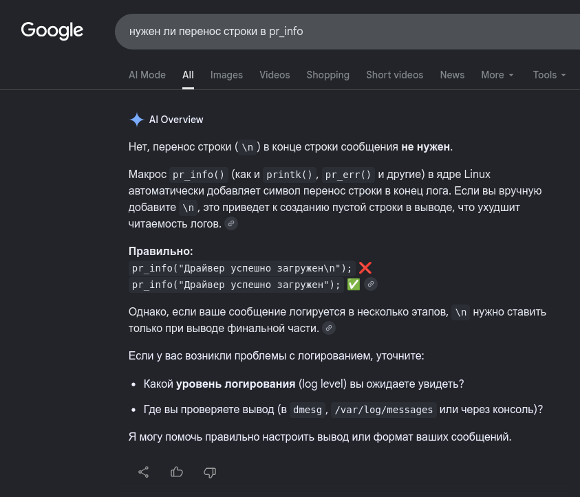

**Задание 20 - Модули ядра Linux**

## Базовый модуль

Написал базовый модуль как в лекции. 

Добавил форматирование через `pr_fmt`, чтобы в начале каждой записи в **dmesg** выводилось название модуля.
[Исходный код модуля](module_pr_info.c)

### Компиляция

Скомпилировал используя **Kbuild** как в лекции:
```
$ make
make -C /lib/modules/7.0.0-dirty/build M=/home/user/Documents/programming_practice/eltex-ibelash-homework/hw20_kernel_modules modules
make[1]: вход в каталог «/usr/src/linux-headers-7.0.0-dirty»
make[2]: вход в каталог «/home/user/Documents/programming_practice/eltex-ibelash-homework/hw20_kernel_modules»
  CC [M]  module_pr_info.o
  MODPOST Module.symvers
  CC [M]  module_pr_info.mod.o
  CC [M]  .module-common.o
  LD [M]  module_pr_info.ko
  BTF [M] module_pr_info.ko
Skipping BTF generation for module_pr_info.ko due to unavailability of vmlinux
make[2]: выход из каталога «/home/user/Documents/programming_practice/eltex-ibelash-homework/hw20_kernel_modules»
make[1]: выход из каталога «/usr/src/linux-headers-7.0.0-dirty»
```

### Загрузка модуля - Попытка №1

Попытался загрузить с помощью `insmod`:

```
$ sudo insmod ./module_pr_info.ko

$ lsmod
Module                  Size  Used by
module_pr_info         12288  0
...
...
...
```

Но `dmesg` не содержит сообщений от модуля, а вместо этого сообщает, что ядро было загрязнено (осквернено):
```
[24460.255868] audit: type=1400 audit(1781953206.359:248): apparmor="DENIED" operation="open" class="file" profile="snap.firmware-updater.firmware-notifier" name="/proc/sys/vm/max_map_count" pid=14978 comm="firmware-notifi" requested_mask="r" denied_mask="r" fsuid=1000 ouid=0
[32399.694029] module_pr_info: loading out-of-tree module taints kernel.
[32399.694050] module_pr_info: module verification failed: signature and/or required key missing - tainting kernel
```

Отключать Secure Boot я не собираюсь, поэтому разбираюсь как подписать модуль.

### Задержка в выводе сообщений

*a few hours later*

Так и не довёл до конца вопрос подписывания модуля. Насколько я понял, нужны ключи, с которыми я собирал ядро, но так как я уже очистил директорию перед тем как собирать под ARM, то этих ключей там быть не должно.

Выяснилось, что запись в `dmesg` происходит с какой-то задержкой или по мере заполнения буфера сообщений, потому что мои сообщения появились вместе с другими сообщениями. А если сравнить вывод `dmesg -T` и `journalctl -k` то можно и примерно задержку оценить.
Например, согласно `dmesg`, модуль был впервые загружен в 20:12:25, выгружен в 21:45:28, опять загружен и выгружен в 22:05:50 и 22:06:27:
```
$ sudo dmesg -T -k | tail -n10
[Сб июн 20 18:00:06 2026] audit: type=1400 audit(1781953206.359:248): apparmor="DENIED" operation="open" class="file" profile="snap.firmware-updater.firmware-notifier" name="/proc/sys/vm/max_map_count" pid=14978 comm="firmware-notifi" requested_mask="r" denied_mask="r" fsuid=1000 ouid=0
[Сб июн 20 20:12:25 2026] module_pr_info: loading out-of-tree module taints kernel.
[Сб июн 20 20:12:25 2026] module_pr_info: module verification failed: signature and/or required key missing - tainting kernel
[Сб июн 20 20:12:25 2026] module_pr_info: Модуль загружен
[Сб июн 20 20:40:20 2026] perf: interrupt took too long (2504 > 2500), lowering kernel.perf_event_max_sample_rate to 79000
[Сб июн 20 21:00:06 2026] audit: type=1400 audit(1781964006.610:249): apparmor="DENIED" operation="open" class="file" profile="snap.firmware-updater.firmware-notifier" name="/proc/sys/vm/max_map_count" pid=23522 comm="firmware-notifi" requested_mask="r" denied_mask="r" fsuid=1000 ouid=0
[Сб июн 20 21:45:28 2026] module_pr_info: Модуль выгружен
[Сб июн 20 22:05:50 2026] module_pr_info: Модуль загружен
[Сб июн 20 22:06:27 2026] module_pr_info: Модуль выгружен
[Сб июн 20 22:15:54 2026] perf: interrupt took too long (3146 > 3130), lowering kernel.perf_event_max_sample_rate to 63000
```

А согласно `journalctl`, впервые загружен в 20:40:20, выгружен в 22:05:49, опять загружен и выгружен в 22:06:27 и 22:15:54:
```
$ journalctl -k -n10
июн 20 18:00:06 oboltus-depo kernel: audit: type=1400 audit(1781953206.359:248): app>
июн 20 20:12:25 oboltus-depo kernel: module_pr_info: loading out-of-tree module tain>
июн 20 20:12:25 oboltus-depo kernel: module_pr_info: module verification failed: sig>
июн 20 20:40:20 oboltus-depo kernel: module_pr_info: Модуль загружен
июн 20 20:40:20 oboltus-depo kernel: perf: interrupt took too long (2504 > 2500), lo>
июн 20 21:00:06 oboltus-depo kernel: audit: type=1400 audit(1781964006.610:249): app>
июн 20 22:05:49 oboltus-depo kernel: module_pr_info: Модуль выгружен
июн 20 22:06:27 oboltus-depo kernel: module_pr_info: Модуль загружен
июн 20 22:15:54 oboltus-depo kernel: module_pr_info: Модуль выгружен
июн 20 22:15:54 oboltus-depo kernel: perf: interrupt took too long (3146 > 3130), lo
```

Сравним:
| Событие | dmesg | journalctl | Разница, мин |
| ------- | ----- | ---------- | ------------ |
| загружен | 20:12:25 | 20:40:20 | 38 |
| другое | 20:40:20 | 20:40:20 | 0 |
| выгружен | 21:45:28 | 22:05:49 | 20 |
| загружен | 22:05:50 | 22:06:27 | 1 |
| выгружен | 22:06:27 | 22:15:54 | 9 |
| другое | 22:15:54 | 22:15:54 | 0 |

Обратил внимание, что в `journalctl` время события совпадает со временем появления следующего события в `dmesg`.

Гугл говорит, что это из-за того, что у меня нет "\n" в конце выводимых сообщений. 

Исправляю. Компилирую. Загружаю. Выгружаю.

И действительно:

```
$ sudo insmod ./module_pr_info.ko
$ sudo rmmod module_pr_info; date 
Сб 20 июн 2026 22:53:25 +07

$ sudo dmesg -T -k | tail -n2
[Сб июн 20 22:52:44 2026] module_pr_info: Модуль загружен
[Сб июн 20 22:53:25 2026] module_pr_info: Модуль выгружен

$ journalctl -k | tail -n2
июн 20 22:52:44 oboltus-depo kernel: module_pr_info: Модуль загружен
июн 20 22:53:25 oboltus-depo kernel: module_pr_info: Модуль выгружен
```

А всё потому что кто-то поверил ИИ на слово:


## Модуль с обменом информацией через файл устройства


