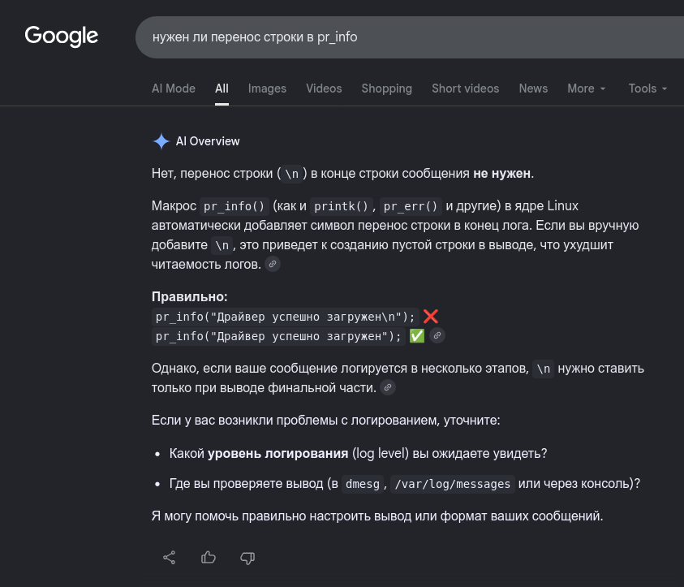
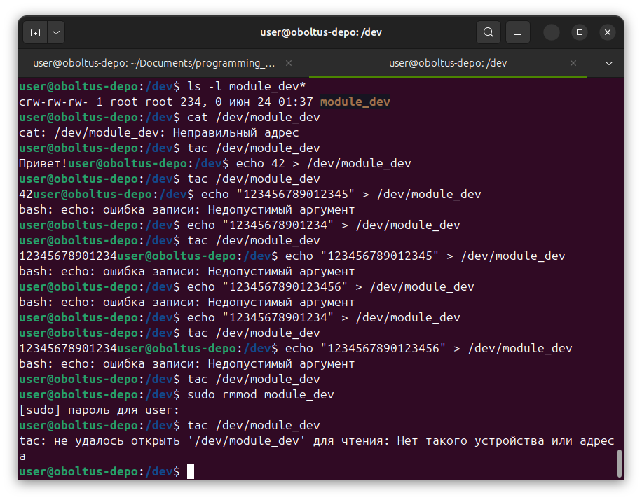
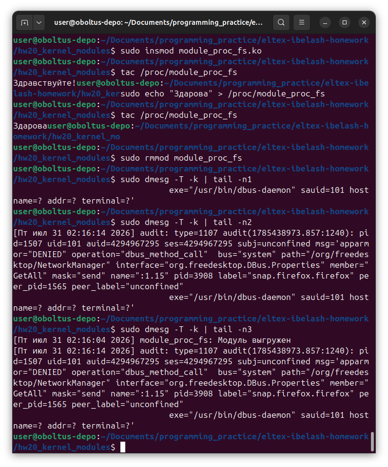

**Задание 20 - Модули ядра Linux**

## Базовый модуль

Написал базовый модуль как в лекции. 

Добавил форматирование через `pr_fmt`, чтобы в начале каждой записи в **dmesg** выводилось название модуля.
[Исходный код модуля](module_pr_info.c)

### Компиляция

Скомпилировал используя **Kbuild** как в лекции:
```
$ make
make -C /lib/modules/7.0.0-dirty/build M=/home/user/Documents/programming_practice/eltex-ibelash-homework/hw20_kernel_modules modules
make[1]: вход в каталог «/usr/src/linux-headers-7.0.0-dirty»
make[2]: вход в каталог «/home/user/Documents/programming_practice/eltex-ibelash-homework/hw20_kernel_modules»
  CC [M]  module_pr_info.o
  MODPOST Module.symvers
  CC [M]  module_pr_info.mod.o
  CC [M]  .module-common.o
  LD [M]  module_pr_info.ko
  BTF [M] module_pr_info.ko
Skipping BTF generation for module_pr_info.ko due to unavailability of vmlinux
make[2]: выход из каталога «/home/user/Documents/programming_practice/eltex-ibelash-homework/hw20_kernel_modules»
make[1]: выход из каталога «/usr/src/linux-headers-7.0.0-dirty»
```

### Загрузка модуля - Попытка №1

Попытался загрузить с помощью `insmod`:

```
$ sudo insmod ./module_pr_info.ko

$ lsmod
Module                  Size  Used by
module_pr_info         12288  0
...
...
...
```

Но `dmesg` не содержит сообщений от модуля, а вместо этого сообщает, что ядро было загрязнено (осквернено):
```
[24460.255868] audit: type=1400 audit(1781953206.359:248): apparmor="DENIED" operation="open" class="file" profile="snap.firmware-updater.firmware-notifier" name="/proc/sys/vm/max_map_count" pid=14978 comm="firmware-notifi" requested_mask="r" denied_mask="r" fsuid=1000 ouid=0
[32399.694029] module_pr_info: loading out-of-tree module taints kernel.
[32399.694050] module_pr_info: module verification failed: signature and/or required key missing - tainting kernel
```

Отключать Secure Boot я не собираюсь, поэтому разбираюсь как подписать модуль.

### Задержка в выводе сообщений

*a few hours later*

Так и не довёл до конца вопрос подписывания модуля. Насколько я понял, нужны ключи, с которыми я собирал ядро, но так как я уже очистил директорию перед тем как собирать под ARM, то этих ключей там быть не должно.

Выяснилось, что запись в `dmesg` происходит с какой-то задержкой или по мере заполнения буфера сообщений, потому что мои сообщения появились вместе с другими сообщениями. А если сравнить вывод `dmesg -T` и `journalctl -k` то можно и примерно задержку оценить.
Например, согласно `dmesg`, модуль был впервые загружен в 20:12:25, выгружен в 21:45:28, опять загружен и выгружен в 22:05:50 и 22:06:27:
```
$ sudo dmesg -T -k | tail -n10
[Сб июн 20 18:00:06 2026] audit: type=1400 audit(1781953206.359:248): apparmor="DENIED" operation="open" class="file" profile="snap.firmware-updater.firmware-notifier" name="/proc/sys/vm/max_map_count" pid=14978 comm="firmware-notifi" requested_mask="r" denied_mask="r" fsuid=1000 ouid=0
[Сб июн 20 20:12:25 2026] module_pr_info: loading out-of-tree module taints kernel.
[Сб июн 20 20:12:25 2026] module_pr_info: module verification failed: signature and/or required key missing - tainting kernel
[Сб июн 20 20:12:25 2026] module_pr_info: Модуль загружен
[Сб июн 20 20:40:20 2026] perf: interrupt took too long (2504 > 2500), lowering kernel.perf_event_max_sample_rate to 79000
[Сб июн 20 21:00:06 2026] audit: type=1400 audit(1781964006.610:249): apparmor="DENIED" operation="open" class="file" profile="snap.firmware-updater.firmware-notifier" name="/proc/sys/vm/max_map_count" pid=23522 comm="firmware-notifi" requested_mask="r" denied_mask="r" fsuid=1000 ouid=0
[Сб июн 20 21:45:28 2026] module_pr_info: Модуль выгружен
[Сб июн 20 22:05:50 2026] module_pr_info: Модуль загружен
[Сб июн 20 22:06:27 2026] module_pr_info: Модуль выгружен
[Сб июн 20 22:15:54 2026] perf: interrupt took too long (3146 > 3130), lowering kernel.perf_event_max_sample_rate to 63000
```

А согласно `journalctl`, впервые загружен в 20:40:20, выгружен в 22:05:49, опять загружен и выгружен в 22:06:27 и 22:15:54:
```
$ journalctl -k -n10
июн 20 18:00:06 oboltus-depo kernel: audit: type=1400 audit(1781953206.359:248): app>
июн 20 20:12:25 oboltus-depo kernel: module_pr_info: loading out-of-tree module tain>
июн 20 20:12:25 oboltus-depo kernel: module_pr_info: module verification failed: sig>
июн 20 20:40:20 oboltus-depo kernel: module_pr_info: Модуль загружен
июн 20 20:40:20 oboltus-depo kernel: perf: interrupt took too long (2504 > 2500), lo>
июн 20 21:00:06 oboltus-depo kernel: audit: type=1400 audit(1781964006.610:249): app>
июн 20 22:05:49 oboltus-depo kernel: module_pr_info: Модуль выгружен
июн 20 22:06:27 oboltus-depo kernel: module_pr_info: Модуль загружен
июн 20 22:15:54 oboltus-depo kernel: module_pr_info: Модуль выгружен
июн 20 22:15:54 oboltus-depo kernel: perf: interrupt took too long (3146 > 3130), lo
```

Сравним:
| Событие | dmesg | journalctl | Разница, мин |
| ------- | ----- | ---------- | ------------ |
| загружен | 20:12:25 | 20:40:20 | 38 |
| другое | 20:40:20 | 20:40:20 | 0 |
| выгружен | 21:45:28 | 22:05:49 | 20 |
| загружен | 22:05:50 | 22:06:27 | 1 |
| выгружен | 22:06:27 | 22:15:54 | 9 |
| другое | 22:15:54 | 22:15:54 | 0 |

Обратил внимание, что в `journalctl` время события совпадает со временем появления следующего события в `dmesg`.

Гугл говорит, что это из-за того, что у меня нет "\n" в конце выводимых сообщений. 

Исправляю. Компилирую. Загружаю. Выгружаю.

И действительно:

```
$ sudo insmod ./module_pr_info.ko
$ sudo rmmod module_pr_info; date 
Сб 20 июн 2026 22:53:25 +07

$ sudo dmesg -T -k | tail -n2
[Сб июн 20 22:52:44 2026] module_pr_info: Модуль загружен
[Сб июн 20 22:53:25 2026] module_pr_info: Модуль выгружен

$ journalctl -k | tail -n2
июн 20 22:52:44 oboltus-depo kernel: module_pr_info: Модуль загружен
июн 20 22:53:25 oboltus-depo kernel: module_pr_info: Модуль выгружен
```

А всё потому что кто-то поверил ИИ на слово:


&nbsp;

&nbsp;

## Модуль с обменом информацией через файл устройства

За основу был взят предыдущий модуль, к которому добавил функции и структуру как в лекции. Также я решил создавать устройство программно - код подсмотрел в [The Linux Kernel Module Programming Guide](https://sysprog21.github.io/lkmpg/#chardevc).

[Получившийся исходный код модуля](module_dev.c) (см. историю коммитов, чтобы увидеть предыдущие версии этого модуля).

### Компиляция 

Собрал модуль:
```
$ make
make -C /lib/modules/7.0.0-dirty/build M=/home/user/Documents/programming_practice/eltex-ibelash-homework/hw20_kernel_modules modules
make[1]: вход в каталог «/usr/src/linux-headers-7.0.0-dirty»
make[2]: вход в каталог «/home/user/Documents/programming_practice/eltex-ibelash-homework/hw20_kernel_modules»
  CC [M]  module_dev.o
module_dev.c:24:9: warning: no previous prototype for ‘read_from_dev’ [-Wmissing-prototypes]
   24 | ssize_t read_from_dev(struct file *fd, char __user *buff, size_t size, loff_t *off) {
      |         ^~~~~~~~~~~~~
module_dev.c:34:9: warning: no previous prototype for ‘write_to_dev’ [-Wmissing-prototypes]
   34 | ssize_t write_to_dev(struct file *fd, const char __user *buff, size_t size, loff_t *off) {
      |         ^~~~~~~~~~~~
  MODPOST Module.symvers
  CC [M]  module_dev.mod.o
  LD [M]  module_dev.ko
  BTF [M] module_dev.ko
Skipping BTF generation for module_dev.ko due to unavailability of vmlinux
make[2]: выход из каталога «/home/user/Documents/programming_practice/eltex-ibelash-homework/hw20_kernel_modules»
make[1]: выход из каталога «/usr/src/linux-headers-7.0.0-dirty»
```

### Загрузка модуля - попытка №1

Загрузил модуль:
```
$ sudo insmod ./module_dev.ko
```

В `dmesg` появились следующие сообщения:

```
...
...
...
[51643.227517] module_dev: loading out-of-tree module taints kernel.
[51643.227523] module_dev: module verification failed: signature and/or required key missing - tainting kernel
[51643.227953] module_dev: Получен основной номер устройства 234
[51643.228055] module_dev: Создан файл устройства /dev/module_dev
[51643.228057] module_dev: Модуль загружен
```

Устройство действительно было создано, но без прав для других пользователей:

```
$ ls -l /dev/module_dev 
crw------- 1 root root 234, 0 июн 23 01:02 /dev/module_dev
```

Разбирался как программно назначить права.

### Загрузка модуля - попытка №2

Разобрался - подсмотрел код в **./fs/pstore/pmsg.c**. Перекомпилировал, выгрузил старую версию модуля, загрузил новую:
```
$ ls -l /dev/module_dev 
crw-rw-rw- 1 root root 234, 0 июн 23 01:30 /dev/module_dev
```

### Чтение из файла устройства

Попытался прочитать:

```
$ cat /dev/module_dev 
cat: /dev/module_dev: Неправильный адрес
```

То есть с `cat` не работает. Зато работает с `less`:
```
$ less -f /dev/module_dev | cat
Привет!
```

### Запись в файл устройства

Запись в файл:
```
$ echo "Ну привет!" > /dev/module_dev 
bash: echo: ошибка записи: Недопустимый аргумент
$ echo "Hello!" > /dev/module_dev
$ less -f /dev/module_dev | cat
Hello!
�ет!
```

Выводит мусор. 

### Борьба с выводимым мусором

Для борьбы с выводимым мусором добавил следующее:

- вычисление длины строки в функцию чтения 
- вставку конца строки в функцию записи. 


Пересобрал модуль
```
$ make
make -C /lib/modules/7.0.0-dirty/build M=/home/user/Documents/programming_practice/eltex-ibelash-homework/hw20_kernel_modules modules
make[1]: вход в каталог «/usr/src/linux-headers-7.0.0-dirty»
make[2]: вход в каталог «/home/user/Documents/programming_practice/eltex-ibelash-homework/hw20_kernel_modules»
  CC [M]  module_dev.o
  MODPOST Module.symvers
  CC [M]  module_dev.mod.o
  LD [M]  module_dev.ko
  BTF [M] module_dev.ko
Skipping BTF generation for module_dev.ko due to unavailability of vmlinux
make[2]: выход из каталога «/home/user/Documents/programming_practice/eltex-ibelash-homework/hw20_kernel_modules»
make[1]: выход из каталога «/usr/src/linux-headers-7.0.0-dirty»
```

Загрузил.
Попробовал почитать и позаписывать (попутно выяснил, что без проблем читается через `tac`, `head`, `tail`):
```
$ tac /dev/module_dev 
Привет!

$ echo "12345678901234" > /dev/module_dev
$ tac /dev/module_dev 
12345678901234

$ echo "123456789012345" > /dev/module_dev
bash: echo: ошибка записи: Недопустимый аргумент
```



&nbsp;

&nbsp;

## Модуль с обменом информацией через proc\_fs

[Исходный код модуля](module_proc_fs.c).

Опять же, за основу был взят предыдущий модуль. Функции чтения и записи совпадают с предыдущим модулем - их наверное надо в отдельную библиотеку выделить.

Я заметил, что в лекции было две различных связки функций чтения и записи в зависимости от версии ядра. Я добавил заголовочный файл, в котором разместил условия и макросы с объявлением структур обёрток для условной компиляции в зависимости от наличия поддержки структуры proc\_ops. Идею про дополнительный заголовочный файл подчерпнул на [сайте U-Boot](https://docs.u-boot-project.org/en/latest/develop/codingstyle.html#conditional-compilation).

### Компиляция

Чтобы задействовать дополнительный заголовочный файл, в *Makefile* была добавлена следующая директива:

```
ccflags-y += -I$(PWD)
```

Собственно компиляция:

```
$ make
make -C /lib/modules/7.0.0-28-generic/build M=/home/user/Documents/programming_practice/eltex-ibelash-homework/hw20_kernel_modules modules
make[1]: вход в каталог «/usr/src/linux-headers-7.0.0-28-generic»
make[2]: вход в каталог «/home/user/Documents/programming_practice/eltex-ibelash-homework/hw20_kernel_modules»
warning: the compiler differs from the one used to build the kernel
  The kernel was built by: x86_64-linux-gnu-gcc-13 (Ubuntu 13.3.0-6ubuntu2~24.04.1) 13.3.0
  You are using:           gcc-13 (Ubuntu 13.3.0-6ubuntu2~24.04.1) 13.3.0
  CC [M]  module_proc_fs.o
  MODPOST Module.symvers
  LD [M]  module_proc_fs.ko
  BTF [M] module_proc_fs.ko
Skipping BTF generation for module_proc_fs.ko due to unavailability of vmlinux
make[2]: выход из каталога «/home/user/Documents/programming_practice/eltex-ibelash-homework/hw20_kernel_modules»
make[1]: выход из каталога «/usr/src/linux-headers-7.0.0-28-generic»
```

### Загрузка модуля

```
$ sudo insmod module_proc_fs.ko
```

Проверяем, что загрузилось:

```
$ ls -l /proc/module_proc_fs 
-rw-rw-rw- 1 root root 0 июл 31 02:05 /proc/module_proc_fs

$ sudo dmesg -T -k
....
....
....
[Пт июл 31 02:05:31 2026] module_proc_fs: loading out-of-tree module taints kernel.
[Пт июл 31 02:05:31 2026] module_proc_fs: module verification failed: signature and/or required key missing - tainting kernel
[Пт июл 31 02:05:31 2026] module_proc_fs: Модуль загружен
```

### Чтение из файла

```
$ tac /proc/module_proc_fs 
Здравствуйте!
```


### Запись в файл

```
$ sudo echo "Здарова" > /proc/module_proc_fs
$ tac /proc/module_proc_fs 
Здарова
```

### Выгружаем модуль

```
$ sudo rmmod module_proc_fs

$ sudo dmesg -T -k | tail -n3
[Пт июл 31 02:16:04 2026] module_proc_fs: Модуль выгружен
....
```




&nbsp;

&nbsp;

## Модуль с обменом информацией через sys\_fs

[Получившийся исходный код модуля](module_sys_fs.c)

### Компиляция

Добавил в *Makefile* проверку `cppcheck` и получил следующие предупреждения:

```
....
Checking module_sys_fs.c ...
4/4 files checked 100% done
module_proc_fs.c:59:0: style: The function 'init_module' is never used. [unusedFunction]
int init_module(void) {
^
module_proc_fs.c:77:0: style: The function 'cleanup_module' is never used. [unusedFunction]
void cleanup_module(void) {
^
....
```

Аналогичные предупреждения были и для всех предыдущих модулей. 
Так как функции `init_module` и `cleanup_module` не рекомендуются к
использованию начиная с версии ядра 2.3.13, а с версии 6.15.3 вообще
объявлены устаревшими и прерывают компиляцию на x86 с IBT, то я решил
заменить их на рекомендованные макросы `module_init` и `module_exit`
во всех модулях.

Источники информации:

https://sysprog21.github.io/lkmpg/#hello-and-goodbye

https://github.com/torvalds/linux/commit/4fab2d76


После изменений компиляция прошла успешно:

```
$ make
clang-format -i --style=Google module_dev.c module_pr_info.c module_proc_fs.c module_sys_fs.c
cppcheck --enable=all --suppress=missingIncludeSystem module_dev.c module_pr_info.c module_proc_fs.c module_sys_fs.c
Checking module_dev.c ...
1/4 files checked 45% done
Checking module_pr_info.c ...
2/4 files checked 52% done
Checking module_proc_fs.c ...
3/4 files checked 74% done
Checking module_sys_fs.c ...
4/4 files checked 100% done
nofile:0:0: information: Active checkers: 106/592 (use --checkers-report=<filename> to see details) [checkersReport]

make -C /lib/modules/7.0.0-28-generic/build M=/home/user/Documents/programming_practice/eltex-ibelash-homework/hw20_kernel_modules C=2 modules
make[1]: вход в каталог «/usr/src/linux-headers-7.0.0-28-generic»
make[2]: вход в каталог «/home/user/Documents/programming_practice/eltex-ibelash-homework/hw20_kernel_modules»
/usr/src/linux-headers-7.0.0-28-generic/Makefile:1216: C=2 specified, but sparse is not available or not up to date
warning: the compiler differs from the one used to build the kernel
  The kernel was built by: x86_64-linux-gnu-gcc-13 (Ubuntu 13.3.0-6ubuntu2~24.04.1) 13.3.0
  You are using:           gcc-13 (Ubuntu 13.3.0-6ubuntu2~24.04.1) 13.3.0
  CC [M]  module_sys_fs.o
  MODPOST Module.symvers
  CC [M]  module_sys_fs.mod.o
  LD [M]  module_sys_fs.ko
  BTF [M] module_sys_fs.ko
Skipping BTF generation for module_sys_fs.ko due to unavailability of vmlinux
make[2]: выход из каталога «/home/user/Documents/programming_practice/eltex-ibelash-homework/hw20_kernel_modules»
make[1]: выход из каталога «/usr/src/linux-headers-7.0.0-28-generic»
```


### Загрузка модуля

Загрузка модуля прошла успешно:

```
$ sudo insmod module_sys_fs.ko 
[sudo] пароль для user: 

$ lsmod
Module                  Size  Used by
module_sys_fs          12288  0
....

$ ls -l /sys/kernel/module_sys_fs/a_string 
-rw-r--r-- 1 root root 4096 авг  6 20:55 /sys/kernel/module_sys_fs/a_string

$ sudo dmesg -T -k
[sudo] пароль для user:
....
....
....
[Чт авг  6 20:54:54 2026] module_sys_fs: loading out-of-tree module taints kernel.
[Чт авг  6 20:54:54 2026] module_sys_fs: module verification failed: signature and/or required key missing - tainting kernel
[Чт авг  6 20:54:54 2026] module_sys_fs: Модуль загружен
....
```

### Чтение из файла - Попытка №1

А вот чтение не удалось:

```
$ cat /sys/kernel/module_sys_fs/a_string 
Убито

$ head /sys/kernel/module_sys_fs/a_string 
Убито

$ sudo dmesg -T -k | tail -n20
[Чт авг  6 20:55:41 2026]  </TASK>
[Чт авг  6 20:55:41 2026] Modules linked in: module_sys_fs(OE) snd_seq_dummy snd_hrtimer qrtr snd_hda_codec_intelhdmi snd_hda_codec_hdmi intel_rapl_msr intel_rapl_common x86_pkg_temp_thermal intel_powerclamp coretemp kvm_intel cmdlinepart spi_nor kvm mtd at24 irqbypass ghash_clmulni_intel i2c_i801 snd_hda_codec_alc882 snd_hda_codec_realtek_lib aesni_intel rapl spi_intel_platform snd_hda_codec_generic i2c_smbus snd_hda_intel sunrpc binfmt_misc mei_hdcp mei_pxp spi_intel intel_cstate i2c_mux snd_usb_audio snd_hda_codec snd_hda_core snd_usbmidi_lib gspca_zc3xx snd_intel_dspcfg snd_ump snd_intel_sdw_acpi gspca_main videobuf2_vmalloc snd_hwdep videobuf2_memops snd_seq_midi i915 snd_seq_midi_event snd_pcm videobuf2_v4l2 lpc_ich snd_rawmidi videobuf2_common mei_me videodev snd_seq mei drm_buddy snd_seq_device ttm snd_timer drm_display_helper cec rc_core i2c_algo_bit tpm_infineon snd soundcore mc input_leds mac_hid serio_raw sch_fq_codel msr parport_pc ppdev lp parport efi_pstore nfnetlink dmi_sysfs ip_tables x_tables autofs4 btrfs
[Чт авг  6 20:55:41 2026]  libblake2b xor raid6_pq hid_plantronics hid_generic usbhid hid e1000e ahci video libahci wmi
[Чт авг  6 20:55:41 2026] CR2: 0000000000000000
[Чт авг  6 20:55:41 2026] ---[ end trace 0000000000000000 ]---
[Чт авг  6 20:55:41 2026] RIP: 0010:simple_read_from_buffer+0x12/0xd0
[Чт авг  6 20:55:41 2026] Code: 0f 1f 84 00 00 00 00 00 90 90 90 90 90 90 90 90 90 90 90 90 90 90 90 90 0f 1f 44 00 00 55 48 89 e5 41 57 41 56 41 55 41 54 53 <4c> 8b 22 4d 85 e4 0f 88 9d 00 00 00 4d 39 c4 73 71 48 85 f6 74 6c
[Чт авг  6 20:55:41 2026] RSP: 0018:ffffd1f6e5373b90 EFLAGS: 00010246
[Чт авг  6 20:55:41 2026] RAX: 0000000000000000 RBX: 0000000000000019 RCX: ffffffffc11650a0
[Чт авг  6 20:55:41 2026] RDX: 0000000000000000 RSI: 000000000000001e RDI: ffff8c40499e0000
[Чт авг  6 20:55:41 2026] RBP: ffffd1f6e5373bb8 R08: 0000000000000019 R09: 0000000000000000
[Чт авг  6 20:55:41 2026] R10: 0000000000000000 R11: 0000000000000000 R12: ffff8c40499e0000
[Чт авг  6 20:55:41 2026] R13: ffff8c404aaa5480 R14: ffff8c41ce76bfc0 R15: ffff8c404b2c8960
[Чт авг  6 20:55:41 2026] FS:  000075f33524a740(0000) GS:ffff8c43d1fe3000(0000) knlGS:0000000000000000
[Чт авг  6 20:55:41 2026] CS:  0010 DS: 0000 ES: 0000 CR0: 0000000080050033
[Чт авг  6 20:55:41 2026] CR2: 0000000000000000 CR3: 0000000280e1c006 CR4: 00000000001726f0
[Чт авг  6 20:55:41 2026] note: head[41808] exited with irqs disabled
[Чт авг  6 20:55:41 2026] note: head[41808] exited with preempt_count 1
```

### Почему "Убито"?

В `dmesg` обнаружил следующие сообщения:

```
[Чт авг  6 20:55:41 2026] BUG: kernel NULL pointer dereference, address: 0000000000000000
[Чт авг  6 20:55:41 2026] #PF: supervisor read access in kernel mode
[Чт авг  6 20:55:41 2026] #PF: error_code(0x0000) - not-present page
[Чт авг  6 20:55:41 2026] PGD 0 P4D 0 
[Чт авг  6 20:55:41 2026] Oops: Oops: 0000 [#2] SMP PTI
[Чт авг  6 20:55:41 2026] CPU: 0 UID: 1000 PID: 41808 Comm: head Tainted: G      D    OE       7.0.0-28-generic #28~24.04.1-Ubuntu PREEMPT(lazy) 
[Чт авг  6 20:55:41 2026] Tainted: [D]=DIE, [O]=OOT_MODULE, [E]=UNSIGNED_MODULE
[Чт авг  6 20:55:41 2026] Hardware name: DEPO Computers To be filled by O.E.M./Q87M-D2H, BIOS F7 01/17/2014
[Чт авг  6 20:55:41 2026] RIP: 0010:simple_read_from_buffer+0x12/0xd0
```

Спустя несколько часов выяснил, что я передавал число туда, где ожидался указатель. Вместо указателя на смещение (offset), передавал ноль.
Починил добавлением локальной переменной:

```
  loff_t pos = 0;  // всегда читаем с начала строки
```


### Чтение из файла - Попытка №2

Скомпилировал, подключил модуль, и ошибка изменилась:

```
$ head /sys/kernel/module_sys_fs/a_string
head: ошибка чтения '/sys/kernel/module_sys_fs/a_string': Неправильный адрес
```

То есть errno = 14 или EFAULT (Bad address).

`dmesg` в этот раз молчит - отображается только сообщение, которое я добавил для отладки:

```
$ sudo dmesg -T -k -w
[sudo] пароль для user:
....
....
[Пт авг  7 19:25:29 2026] module_sys_fs: Модуль загружен

[Пт авг  7 19:25:41 2026] module_sys_fs: DEBUG: buf 000000000237d4d5, a_string 000000009add9db2

```

В логах тоже ничего не отображается кроме отладочного сообщения:

```
$ tail -fn0 /var/log/*
....
....

==> /var/log/kern.log <==
2026-08-07T19:43:42.689353+07:00 oboltus-depo kernel: module_sys_fs: DEBUG: buf 0000000006ee9dc0, a_string 000000009add9db2

==> /var/log/syslog <==
2026-08-07T19:43:42.689353+07:00 oboltus-depo kernel: module_sys_fs: DEBUG: buf 0000000006ee9dc0, a_string 000000009add9db2
^C
```

Я поэкспериментировал ещё немного и ... 

### Чтение из файла - Попытка №3

и махнул на это рукой - заменил `simple_read_from_buffer` на `sysfs_emit` по образцу из примеров в исходниках ядра (_samples/kobject/kobject-example.c_). 

В этот раз успешно прочиталось:

```
$ sudo insmod module_sys_fs.ko

$ head /sys/kernel/module_sys_fs/a_string 
Здравствуйте!
```

### Запись в файл


### Выгружаем модуль

